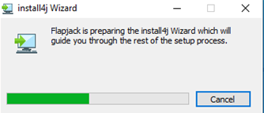

# Session 2: Flapjack basic operation

## Welcome to Flapjack basic operation training.

### Session 2: Flapjack Basic Operation
We have learned a bit of background in Session 1, now let’s have a look at downloading and familiarising ourselves with Flapjack. 

This tutorial will guide you through how to download and open flapjack & also how to familiarise ourselves with the application.

>Downloading Flapjack
Where can I download flapjack? Flapjack is available to download from the James Hutton Institute, Information and Computer Sciences web pages.

### What platforms can Flapjack run on?
Flapjack is available on Windows (64 bit), MacOS and if you prefer using the command line a Linux (64 bit) version exists. If you use Bioconda, then Flapjack can be installed with: conda install flapjack.

In this tutorial, we will use the Windows (64 bit) version as an example
Follow the instructions provided by the graphical installer to install Flapjack. Note that Flapjack should not require administrator privileges to install or run.

Now we have Flapjack installed, what does the user interface look like? Open the Flapjack program and you will be preseted with the following screen.

The welcome screen offers several options such as importing data, opening a previously accessed project, and learning more about Flapjack including links to the online Flapjack user manual and how to cite Flapjack in your own work.

This tutorial has explained how to download Flapjack and we’ve had a quick look at the initial user interface. We are now ready to import our data and create a flapjack project so check out the next tutorial for project input file details.

# Tasks

1. 

Download and install Flapjack on your computer (if it has not already been installed for you)
You can download Flapjack from <a href="https://ics.hutton.ac.uk/flapjack/download-flapjack/">https://ics.hutton.ac.uk/flapjack/download-flapjack</a>. Before you download check to see if the software is already installed on your machine. On Windows deviced you can do this by pressing ⊞ Win then typing "flapjack".

2. 

Explore the Flapjack online manual, checking relevant topics for your workflow.
You can access the online user manual here <a href="http://flapjack.hutton.ac.uk/en/latest">http://flapjack.hutton.ac.uk/en/latest</a>

 

> ### About
> This training has been created under the <a href="https://www.templetonworldcharity.org/">Templeton World Charity Foundation, Inc.</a> Grant ID TWCF0400 *'Safeguarding crop diversity for food security: Pre-breeding complemented with Innovative Finance'* which is managed by the <a href="https://www.croptrust.org/">Crop Trust</a>. This training is free to use and released under a non-restrictive open source licence.
