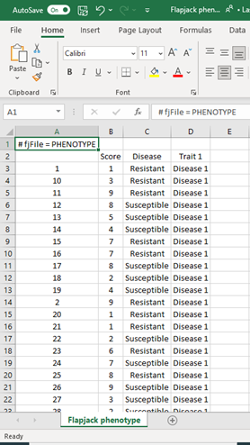

# Session 3: Flapjack input files

## Flapjack Input file Structure and Format
Great! We now have Flapjack downloaded and become familiar with several helpful features.
In this tutorial we will look at how we create different input files, how they are structured and formatted ready for importing.

### File Types
What types of files can be imported into Flapjack?
4 basic file types can be imported into Flapjack.
<ol>
    <li>Map file</li>
    <li>Genotype file</li>
    <li>Phenotype file</li>
    <li>QTL (or features) file</li>
</ol>

Bear in mind a Flapjack project can be created using only a Map and Genotype file however greater functionality and analysis features are available if phenotype and QTL information are used. 

### File Format
What file format does Flapjack use?

Input files should be in tab delimited format. The examples we’ll look at have been created in Microsoft Excel. Use ‘Save as’ option in Microsoft Excel and select Text (Tab delimited). 

Let’s look at examples of each file type:

#### Map file
A map file should contain a header line #fjfile = MAP. It should contain a column with your marker name, a column with a chromosome designation and a column with physical or genetic marker location. Don’t panic if your chromosome and locations aren’t in order, flapjack will do this for you!

 
#### Genotype file
A Genotype file should contain a header line #fjfile = GENOTYPE. It should contain a column containing your sample name, a row containing markers names which should match marker names in your map file and allele scores from your successful assay. 

 
#### Phenotype file
A phenotype file should contain the header line #fjfile = Phenotype. It should contain a row of sample names which match your Genotype file, and columns which contain phenotype scores in either in categories or numbers.

 
A Features or QTL file contains the header #fjfile = QTL and should contain a minimum of 7 columns. Column A contains your QTL name, Columns B and C refer to QTL chromosome and maker location which must match the marker information from your map file. Columns D - E (Pos-min and Pos-max) refer to the range where your QTL lies on your map. Column F contain trait name and column G refers to the experiment in question. Additional information can be added to enhance analysis.

 
We are now at the stage where we can create a flapjack project. In the next tutorial we will look at importing your data.

# Tasks
1.	

Save Tutorial Microsoft Excel files Flapjack Genotypes, Flapjack Map, Flapjack Phenotypes, Flapjack QTL as Text Tab delimited files
Hello World

 

> ### About
> This training has been created under the <a href="https://www.templetonworldcharity.org/">Templeton World Charity Foundation, Inc.</a> Grant ID TWCF0400 *'Safeguarding crop diversity for food security: Pre-breeding complemented with Innovative Finance'* which is managed by the <a href="https://www.croptrust.org/">Crop Trust</a>. This training is free to use and released under a non-restrictive open source licence.
