# Session 4: Flapjack import and navigating

## Welcome to Flapjack import and navigating training.

Now we have Flapjack downloaded and suitably formatted input files, this is the exciting stage of importing and viewing data in Flapjack!
In this tutorial where we will cover the following topics:
1)	Importing data files
2)	Navigation and familiarising ourselves with the interface
Importing Data
Data can be imported from either the File menu:

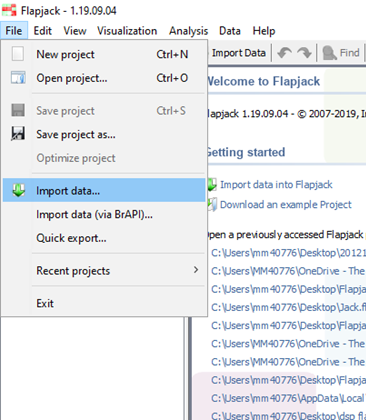

The Icon ribbon:

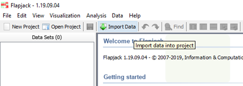

Getting Started Menu:

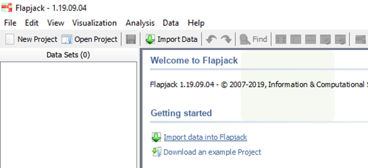

First, Select the Genotype and Map data you’d like to import from the selection of tabs in the import data window. As mentioned previously, a map and genotype file are all that’s required to create a flapjack project.

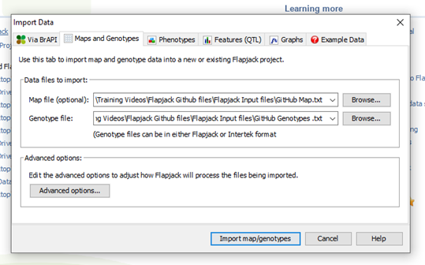

Browse and select your desired files and click the Import map/genotypes option.

Data Navigation 
Now we can start to start to examine our genotype and map data.
Viewing data by Chromosome
Navigating between different chromosomes is achieved by using the Chromosome pull down menu

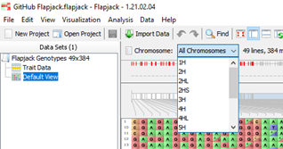

Data Visualisation
It’s possible to zoom in and out of the genotype view using either the zoom bar at the bottom right-hand side of the flapjack window 

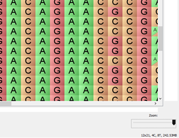

Another zoom option exists by using your mouse scroll wheel with the control key held down.

Using the scroll bar at the bottom of the flapjack window allows for navigation along the selected chromosome.
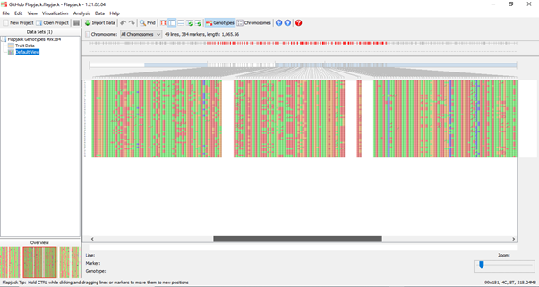

Distribution of markers visible on screen can be viewed below the chromosome layout above the genotype data.

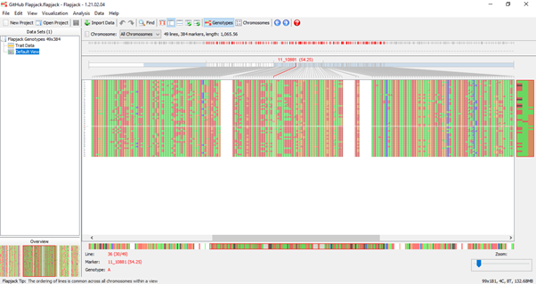

Line, marker, and genotype is displayed at the bottom of the flapjack window as the mouse is placed over the genotype data and the overview window (bottom left-hand side) displays full chromosome view.
Now we’ve imported our map and genotype data, are comfortable navigating between and along chromosomes in genotype view lets looks at other importing options.
Importing Phenotypes
To import phenotype information, again use the import data options available, browse and select the appropriate file and click import

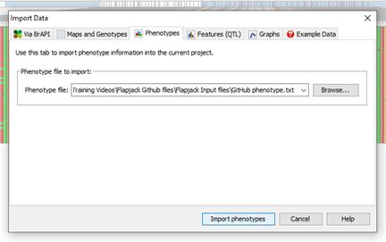

A helpful summary window will appear

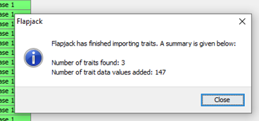

Phenotype information can be viewed from the table, and flapjack uses a heatmap display which can be switched off if desired. 

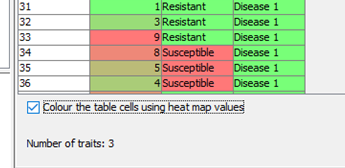

When we select the default view, we can see our phenotypic information displayed next to our genotype names and the heatmap data is also visible.

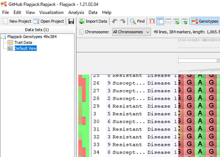

Importing QTLs or Features
To import QTL or features information, again use the import data options available, browse and select the appropriate file and click import

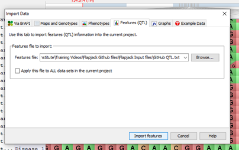

A helpful summary window will appear

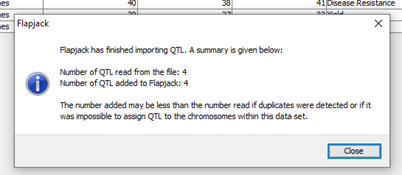

The displayed table shows our QTL data, chromosome, location, trait and associated experimental information
We can select default view and for example on chromosome 3H we can now see a QTL for disease resistance. Clicking on the QTL displays markers involved with this feature.

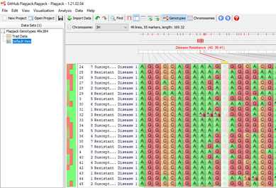

It’s possible to create multiple views of your data to allow for various analysis within one project by right clicking on ‘default view’ in the data set window and selecting create new view. 

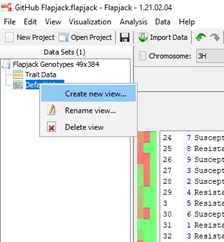

An option for naming your duplicate data set is available.
Once you have all the information required for your project, select save project. You can now access this project for further analysis at any time.

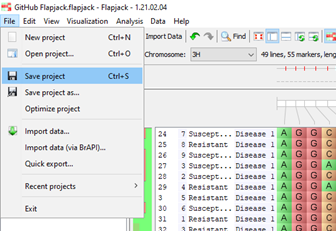

Now we have map, genotype, phenotype and QTL data imported in flapjack we can see just how powerful this application is!
Did you know?
Advanced import options are available which can come in very handy depending how your data is formatted.
For example, options available are for viewing all your markers together, flapjack offers flexibility for heterozygous allele formatting, and it allows for duplicate line names to be imported. Flapjack also offers options for different heterozygous and missing data characters. Flapjack can also transpose your data if required

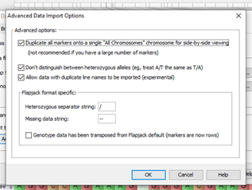

Please move onto the next tutorial to learn more about data view and visualisations options.

 

1.	

Import Flapjack Map & Flapjack Genotype files to create a Flapjack project
Hello World

2.	

Move between Chromosomes>
Hello World
 
3.	

Scroll along individual chromosomes
Hello World

4.	

Zoom in and out of Genotype views
Hello World

5.	

Import Flapjack Phenotype and Flapjack QTL files
Hello World

6.	

Check phenotype data / heatmap
Hello World

7.	

Locate QTLs on different chromosomes
Hello World

8.	

Save Flapjack project
Hello World

> ### About
> This training has been created under the <a href="https://www.templetonworldcharity.org/">Templeton World Charity Foundation, Inc.</a> Grant ID TWCF0400 *'Safeguarding crop diversity for food security: Pre-breeding complemented with Innovative Finance'* which is managed by the <a href="https://www.croptrust.org/">Crop Trust</a>. This training is free to use and released under a non-restrictive open source licence.
