# Session 5: Flapjack data views and visualization options

## Welcome to Flapjack data views and visualization training.

Let's have a quick recap. If you've reached far in this series of tutorials, well done! There will be a saved Flapjack project containing an imported a genotype file, map file, a phenotype file and a QTL or features file.
In this tutorial, we'll look at data view options and a few different approaches for viewing specific types of data. The aim is to become comfortable interrogating and viewing different aspects of your data.
View Options
There are 2 data view options available:
1. Genotype view
2. Chromosome view
Each mode can be accessed from either the view menu 
 
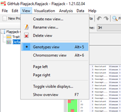

the ribbon icon menu

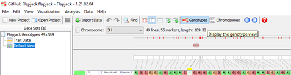

or keyboard shortcuts Alt 5 or Alt 6.
Chromosome View
The Chromosome View shows a graphical representation of each chromosome with name, number of makers and chromosome length displayed. Clicking on an individual chromosome reveals a marker density heat map.

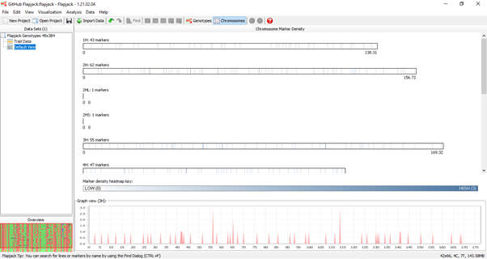

Genotype View
The Genotype view is default and allows for data selection and analysis
Genotype view has 3 visualisation modes:
1. Navigation mode
2. Marker mode
3. Line mode
Each mode can be accessed from either the edit menu 

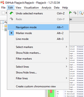

or the ribbon icon menu

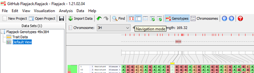

Or Alt 1, Alt 2 or Alt3 keyboard shortcuts.
When moving between modes this warning window will appear but can be deselected if desired.
Navigation Mode
Navigation mode is self-explanatory, here we visualise chromosomes, QTLs, phenotypes and associated information.
In navigation mode, there are also several visualization menu options available:
Genotype scores can be overlayed or removed from the graphical output using the Overlay genotypes option

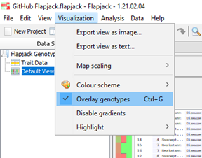

Heterozygotes, homozygous and missing data can all be highlighted and lowlighted using the highlight option in the visualisation menu.

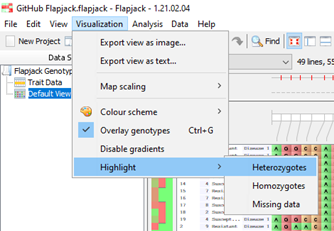

Several colour highlight options are available, and many can be useful for checking data without involved analysis
Let's look at an example:
In the visualization menu, select Colour scheme and Similarity to line – Allele match

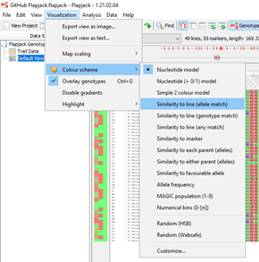

Let's select the line we want to compare (for this example we'll use 1), then click ok
All lines in this project which have a similar allele to 1 are now coloured green, all alleles which do not match are red. We can very quickly see areas of the genome which match and do not match with this line.

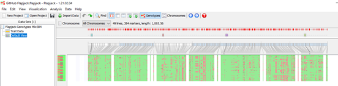

Other colour scheme options available are similarity to line genotype or any match, similarity to parents which is useful if we were working with a mapping population, similarity to a favourable allele which we would have specified in the genotype file and visualising alleles at user specified frequencies. 
To return to the default view, select the visualisation menu, colour scheme and nucleotide model.

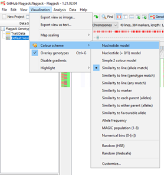

Marker & Line Modes
Marker and line modes are particularly useful for developing a subset of informative markers and lines for analysis 
We may not want all lines present in the project included in a specific analysis. This might be due to either certain lines which are superfluous to a project or potentially, poorer quality data exists in the project and therefore should be removed.
Before we start looking at line and marker mode, it's worth bearing in mind that by default, flapjack selects all lines and markers automatically
Marker Mode
We'll start by looking at the marker mode option. Marker mode is selected in the edit menu

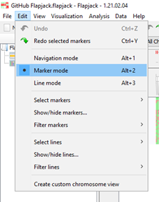

the ribbon icon menu

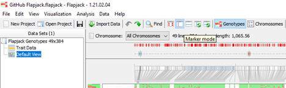

Or Alt 2 keyboard shortcut
In marker mode, markers can be deselected by clicking and or dragging on specific markers in the Genotype view. In this screenshot we can see markers deselected on Chromosome 1H. They are now removed from our analysis but are visible in the genotype view. 

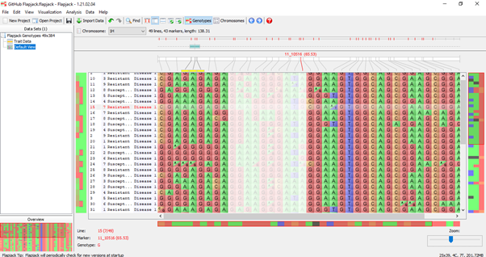

It's possible to remove them from the genotype view by selecting the edit menu, clicking the ‘Show/hide marker option 

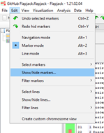

then clicking the ‘Hide all the markers that are NOT currently selected option. 

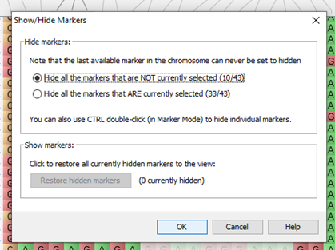

They will disappear from view and any analysis carried out but can be re-introduced at any time using the same menu options and select Restore hidden markers. 

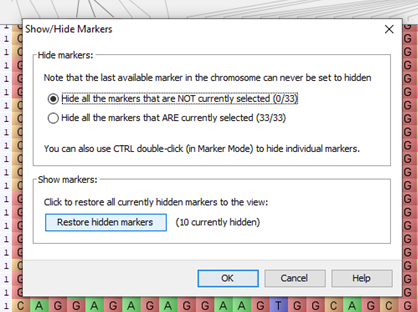

It is also possible to filter markers in marker mode. 
Filtering options include missing markers and heterozygous markers. 
Filtering levels are controlled using the percentage slider and specific chromosomes can also be selected for filtering. 
Let's look at an example:
If we wanted to filter our data based on missing values, maybe to remove SNPs which have performed poorly in our assay, select the filter markers option from the edit menu and select missing markers. 

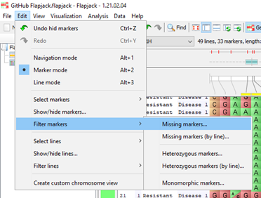

Select the chromosomes we want to use for filtering then using the slider choose the level of filtering required. Lower percentages will be more stringent. 

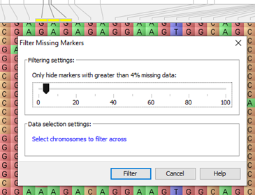

Flapjack will display the number of markers falling into this category. 

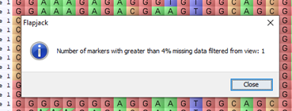

Monomorphic markers can be filtered using the filter menu option or in the edit menu under select markers and select monomorphic markers.

Select the chromosomes we wish to include and hit select. 

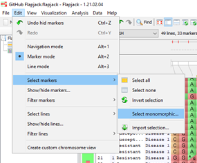

Flapjack will then show the number of monomorphic markers filtered from the project.

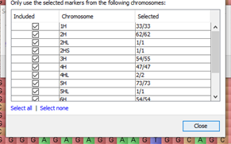

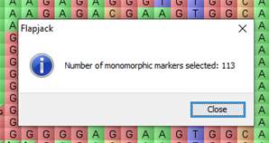

This will leave only polymorphic markers. 
Using these options will result in a set of markers suitable for use in our analysis.
Line Mode
The same process can be applied to lines by clicking in line mode. 
Lines can be deselected by clicking and or dragging on specific Lines in the Genotype view.
They are now removed from our analysis but are visible in the genotype view. 
It's possible to remove them from the genotype view by selecting the edit menu, clicking the ‘Show/hide line option and clicking the ‘Hide all the lines that are NOT currently selected option. 
They will disappear from view and any analysis carried out but can be re-introduced at any time using the same menu options and select Restore hidden lines.
Lines can also be filtered using the filter lines option in the edit menu. 
Lines can be filtered on missing lines, heterozygous lines and homozygous lines. 
Filtering levels are controlled using the percentage slider and specific chromosomes can also be selected for filtering. 
Let's look at an example:
If we were working with cultivars or pure breeding lines, we would not expect high levels of heterozygosity. 
Using the edit menu, select filter lines, then heterozygous lines. The following filter options appear. Select the chromosomes we'd like to use in our filtering then using the slider, select our cut off for heterozygosity. 
Lower percentages will be more stringent. Flapjack will display the number of lines falling into this category.
We have now selected the markers and lines we want to include in our analysis.
Please move onto the next tutorial for more information

 

> ### About
> This training has been created under the <a href="https://www.templetonworldcharity.org/">Templeton World Charity Foundation, Inc.</a> Grant ID TWCF0400 *'Safeguarding crop diversity for food security: Pre-breeding complemented with Innovative Finance'* which is managed by the <a href="https://www.croptrust.org/">Crop Trust</a>. This training is free to use and released under a non-restrictive open source licence.
