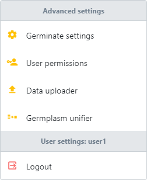
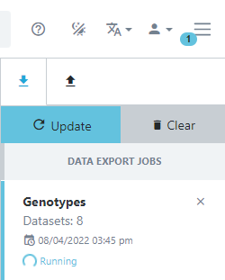

<!-- Use these horrible HTML tag attributes because Markdown only supports limited HTML/CSS -->

  

Contact us: [germinate@hutton.ac.uk](mailto:germinate@hutton.ac.uk) or [@germinatehub](https://www.twitter.com/germinatehub) on Twitter

# Session 2: The Germinate Web Interface

This tutorial will guide you through the main components of the Germinate interface. All Germinate databases have the same web based user interface so if you become familiar with one, you are familiar with them all. This is an important benefit of Germinate in that its a common platform which has use across a wide variety of crops, providing consisent user interfaces for all.

We can start with watching this short video on the Germinate interface which will give you some background on how the system is organised. Click on the image below to view.

Now thats finished lets look in more detail about the material the video covered. 

> Use your Germinate bookmark from the previous session or to go [https://ics.hutton.ac.uk/germinate-training](https://ics.hutton.ac.uk/germinate-training) to follow along with this material.

### Navigation
All navigation items are found on the left hand side of the Germinate interface. They allow the movement between different data types. Menu items with arrows "<" can be clicked to reveal additional items and toggled by clicking again. 

Most navigation between pages will be done using the menu on the left hand side of the Germinate interface. It looks like this.
 

Where there are arrows "<" (as seen here next to ***Data*** ) this means that if you click on this menu item additional menu items will be displayed. If we click on ***Data*** we see this.

Again, arrows show where additional menu levels can be selected and numbers in dark boxes show the count of items within a category. So for example in this case there are 7 ***Datasets***, 5 ***Experiments*** and 1 ***Data resources***

### Searching

Search is always found both in the left hand menu **and** at the top right hand side of interface in the *settings bar*. This is consistent so no matter what page you are on you will always find search here.

We will cover search in much greater detain in Session 9 'Searching for Data'.

### The Settings Bar

The *settings bar* contains tools and settings. Search allows database wide searching of terms (use % as wildcards in Germinate searches). Next we have *help* which when highlighted indicates additional help is available on the page. *help* is page specific so keep and eye on this and use it to get valuable information on a pages features. *dark mode* is next and lets you toggle between light and dark interface themes. *Dark mode* is useful when working later at night - its also useful for increasing contrast and works better with some colour schemes.

Next we have tools to allow you to use the Germinate interface in languages other than English. By default we prvide Germinate in UK English and German but we do have some databases using Latin American Spanish. We use a tool called [Lokalise](https://lokalise.com/) that allows us to translate Germinate into other languages but need help from the community to do the translations and to identify which languages would be useful. Get in touch if this is something that would be useful for you or you would like to volunteer your service to see Germinate tranlated into your favourite language!

The next option in the *settings bar* is *user options*. *User options* allows you to log into Germinate. The user accounts that we have set up for you as part of this training will give you access to the options here so click on this to reveal *advanced settings*:

*Advanced settings* includes tools to let you change things like colour schemes and API keys for Google Analytics, it also lets you choose which Germinate data pages are visible and whether new user registration is allowed, and if new registrations require approval by a site administrator. This is important as it is rare to have a project that includes all data types that Germinate provides.

 

> Be careful making changes in *advanced settings*, make sure you know what you are doing before making any changes as they appy site wide for all users!

### Asynchronous Downloads Bar
Some of the exports that you can do with Germinate may take a couple of minutes to run (we have datasets that have millions of genetic markers and hundreds of thousands of germplasm entries). Germinate now supports asynchronous downloads. This means that you can request data by running a query then go and do something else with Germinate while the query is executing (or grab a cup of coffee). When the data is ready the interface will let you know and you can download the data from here – no more hanging about waiting on data. To access the downloads click on the three horizontal lines at the top right hand side of the *settings bar* as shown below. 

You can now see jobs which are running or are complete.

We will cover this feature in greater details soon when we look at how you export genotypic data from Germinate.

This short tutorial has highlighted some of the cool features that Germinate offers but the best way is to just dive in and start having an explore!

## Tasks:

1. 

Identify the genetic maps page. How many maps are there?
Answer: 1

2. 

How many genetic markers are on this map?
Answer: There are 5,000 markers on this map.

3. 

How many traits are defined in this database?
Answer: There are 51 traits defined in this database.

4. 

Go to the 'Data Statistics' page. Which country has the largest number of accessions collected there? and how many are there?
Answer: China and we have 304 accessions collected there in our test database.

5. 

Try changing the colour scheme to 'Dark Mode' and changing the interface language - do you remember where those things are?
Answer: They are in the settings bar at the top right hand side of the screen.

Next Steps:  We have learned a bit about the Germinate interface and where basic tools are located, now [lets have a look at working with germplasm in Session 3](session-3.html).

> ### About
> This training has been created under the <a href="https://www.templetonworldcharity.org/">Templeton World Charity Foundation, Inc.</a> Grant ID TWCF0400 *'Safeguarding crop diversity for food security: Pre-breeding complemented with Innovative Finance'* which is managed by the <a href="https://www.croptrust.org/">Crop Trust</a>. This training is free to use and released under a non-restrictive open source licence.
<table bgcolor="white" align="center">
  <tbody>
    <tr>
      <td align="center" valign="middle">
        
      </td>
      <td align="center" valign="middle">
        
      </td>
      <td align="center" valign="middle">
        
      </td>
    </tr>
  </tbody>
</table>