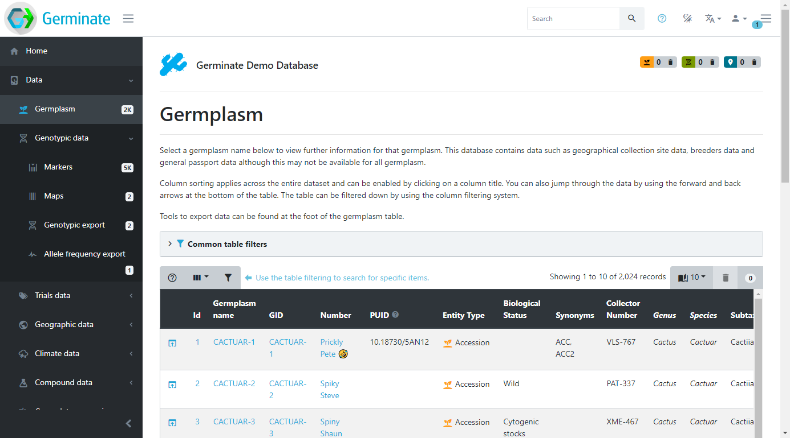

<!-- Use these horrible HTML tag attributes because Markdown only supports limited HTML/CSS -->

  

# Session 3: Working with Germplasm

This tutorial will show you how to work with germplasm entries held in Germinate.

All data that Germinate holds is related back to the underlying germplasm (this is one of our core concepts and the foundataion for tools like Germinate) and so being able to effectively work with germplasm and utislise the tools that we offer is important in becoming proficient with Germinate.

# Before we start

### Getting help 

If you’re ever stuck while using Germinate, use the help button which can alwas be found in the top right hand side of the Germinate interface.

This help provides more information about the current page or functionality. This feature will explain the interface components or the content of the page in more detail. If they help icon is greyed out then additional help information is not available for this page. This screenshot shows the type of information that we hold for the germplasm page in Germinate.

Refer back to help if you are having problems but we are also there to help you so drop us an email on <a href="mailto:germinate@hutton.ac.uk">germinate@hutton.ac.uk</a> with any problems you may encounter.

# So lets get started!

We will use the Germinate demo database in this instance. The demo database contains real data but we have anonomised it and assigned a fictional plant species, the <a href="https://en.wikipedia.org/wiki/Cactuar">Cactaur</a>. We have done this because all projects are different and Germinate supports more data types than projects generally contain. The demo database has all data types we support along with all features available to users to try out in a safe environment.

**Rememeber you can't break anything use the Germinate Demo database to play about with features.**

Firstly we are going to visit this link: <a href="https://ics.hutton.ac.uk/germinate-demo">https://ics.hutton.ac.uk/germinate-demo then once there click on the "Data" menu item on the left hand menu then on the "Germplasm" menu item.

You should now see something like this:

This page shows all the germplasm (accession or samples) that Germinate contains for the chosen database. This is where you can come to browse the accessions and search for germplasm that may be of interest.

## Showing and hiding columns 

Tables within Germinate show **lots** of information. Sometimes, you will only be interested in a specific part of this information and hiding table columns is one way to allow you to focus better. Use the dropdown button in the top left of any table to select the columns you wish to show or hide. These settings are remembered for your session, so they will be remembered *until* you close your browser. If you make a change it only applies to your session so nobody else will see your changes. 

This example shows how you add or remove columns from the Germinate Germplasm page. Click on the show/hide columns option within the table options. This option can be found at the top left hand side of the table beside help and filter options.

Now that you have selected this you can choose which columns to show and hide. Its easy, just click on them to toggle on and off. If you accidentally turn off something you want to see just go back and enable it again. Look at this screenshot, notice how the columns are different?

## Selecting how many entries to show 

Another way to change how data is displayed in tables is changing the number of rows that are shown at a time. By default, Germinate only shows a small number of rows the reduce the amount of scrolling required to take in all the information. To show more rows per page, select a different value from the dropdown menu in the top right of the table. The display will refresh and now show the requested number of rows. Have a play about with this and see which looks best on your monitor screen. Like the table columns this setting remains until you close your browser.

## Sorting and filtering the germplasm table 

All tables within Germinate can be sorted or filtered by any of the columns you see. Sorting happens by clicking on a table header and another click on the same column inverts the sorting direction. This image shows the table header. If you look at the diamond icon next to Germplasm name in the table header you will see how the table is sorted. If the light coloured half is on the top it means the column is sorted alphabetically and on the lower (like here) its reverse alphabetical ordering.  Try clicking on some of the table headers to see what effect the sorting has on the table. The table sorting sorts data across the entire database and not just the lines that are in the current table page.

Filtering is a very useful tool when searching for specific data points. In this example, we are looking at the germplasm table. The filtering dialog is opened by clicking the filter button in the top left of the table. Here, search criteria for each column can be defined and combined allowing simple searches as well as complex queries. To search for germplasm with a certain species, select the species column from the dropdown and then enter the species. This filter can be combined with a search for germplasm from a specific country resulting in only germplasm with the combination of species and country of origin to be displayed in the resulting table. 

The germplasm table also has a section with common filtering options for easier access just above the table. 

Accessions Plants/Plots and Samples 

Germplasm in Germinate is stored at different levels: ‘Accession’, ‘Plant/Plot’ and ‘Sample’ called ‘entity types’. Plant/plot level material is usually derived from accession germplasm and samples can be taken from either plant/plot or accession level. 

What data is available 

The germplasm table has dedicated columns that indicate the types of data available for a germplasm. This is shown by the corresponding icon in each column. The same applies to images where an icon will be shown if images are available and clicking on that icon will show one of the images as an example. 

Adding things to marked lists 

Browsing and filtering tables is usually done to look for germplasm, markers or locations. Once these are found they can be added to a personalised ‘marked list’ akin to a shopping basket. Simply add items to the basket by marking the checkbox in the last column either individually or for the whole table using the column header. 

Passport page 

The passport page of a germplasm is where all information available for this germplasm is aggregated in a single location. Meta-data, pedigrees, location information, images, and data availability are all easily accessible from here. 

Links along the top 

Mark or unmark germplasm 

 

Tasks: 

Go to the germplasm page. Try hiding/showing some columns. 

Using the table filtering, search for germplasm collected in country X. 

With the table filtering active, sort the table by collection date in ascending order. What is the first germplasm in the table? 

Using the marking mechanism, mark the first four germplasm in the table. 

Navigate to the passport page of X, what is Y? 

## Tasks:

1. 

Identify the maps page. How many maps are there?
Answer: X

