<!-- Use these horrible HTML tag attributes because Markdown only supports limited HTML/CSS -->

  

Contact us: [germinate@hutton.ac.uk](mailto:germinate@hutton.ac.uk) or [@germinatehub](https://www.twitter.com/germinatehub) on Twitter

# Session 4: Experiments, Datasets and other Data Resources

Germinate can hold large amounts of experimental data (millions of datapoints). These can include data from phenotypic trials, genotypic SNP (or other indexed polymorphism) data, chemical compound information and climate measurements. Germinate currently supports 3 levels of granularity for data. Individual data points (level 3) make up datasets (level 2). Datasets are assigned to experiments (level 1). So an experiment cotains one more more datasets and a dataset contains one or more datapoints. Figure 1 shows the hierarchey of data levels in Germinate.

***Figure 1 Germinate data levels***

Experiments are the overarching level of granularity. A dataset can only be assiged to one dataset. Experiments are accessed by clicking on the ***Experiments*** menu item on the left hand side Germinate menu.

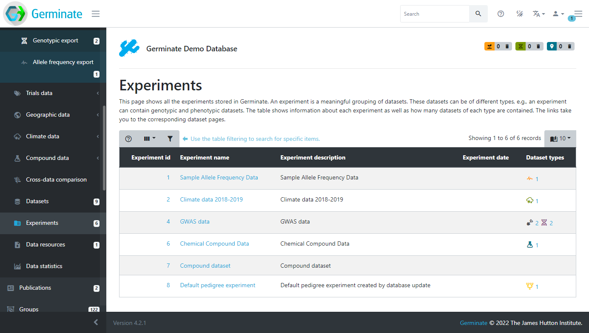

Using the Germinate Demo database we can see that there are 5 different experiments we have access to. If you look closely under the **Dataset types** column you will see that some of them have icons and numbers. The icons shows particular data types; climate, field trials, genotype and chemical compound data types. The number next to each icon shows the number of datasets in the experiment of that type. Take for example the **GWAS data** experiment. This has 2 field trial and 2 gentoype datasets contained within its experiment container. If you are not sure what each icon represents just hover your mouse over it and the description will be displayed in a popup.

Datasets allow experimental data recorded at the same time to be grouped together. An example would be all the trials data for a specific site in a specific year. An experiment allows the grouping of datasets into a logical unit so for example, all the trials data across multiple sites and years. These grouping allow data which is logically related to one another to be grouped together for easy searching and analysis.

Datasets are the smallest grouping of data in Germinate and represent a single unit of data like a single field trial. The datasets page shows all datasets stored in Germinate. Clicking on the dataset name will take you to the corresponding data export pages. The icon buttons at the right side of the table will reveal information about collaborators, dataset attributes and download options. 

Experiments group together coherent datasets into meaningful combinations. This way, field trials data can be linked to the corresponding climate data as well as any genotypic data that is linked to it. The dataset type column shows what types of datasets are contained in this experiment.

When you look at the ***Datasets*** page you may notice that some entries are highlighted (in this case in red). This shows where a data licence has been applied to dataset. Germinate supports assigning licences to datasets. These licences are user defined when the dataset is submitted and can be as restrictive or open as required. All Templeton data for example is released under a CC-BY-NC licence to promote the datas use in other projects. To get additional information on Creative Commons licences have a look at <a href="https://creativecommons.org/">https://creativecommons.org</a> and while other licence are available, and indeed may be more appropriate for your data this is a good starting point.

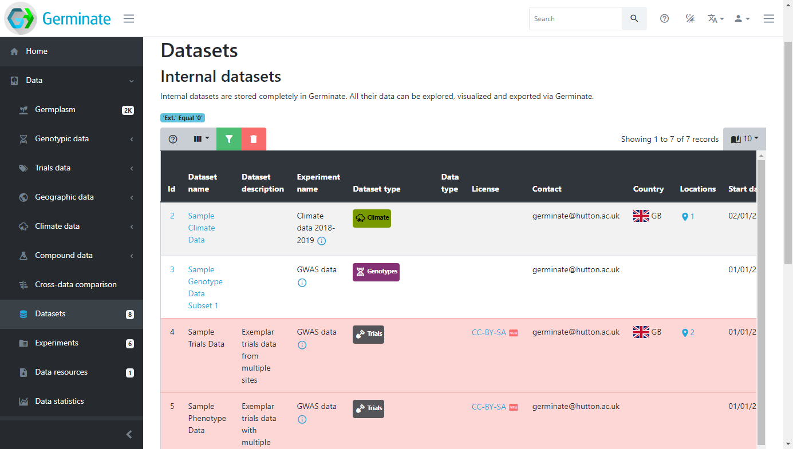

In order to access the data contained within a dataset that has a licence assigned to it you need to agree to the terms of the licence. To do that you need to click on the licence name within the ***Licence*** column in the ***Datasets*** table. When you do this you will see the licence text (see figure x) and you need to click on ***Accept*** to view the dataset. Please make sure to read this licence text if you are using someone elses data as it may contain conditions to the use of the data. Commonly seen restrictions include citing a paper where the data was published or acknowledging the funding source that paid for the generation of the data.

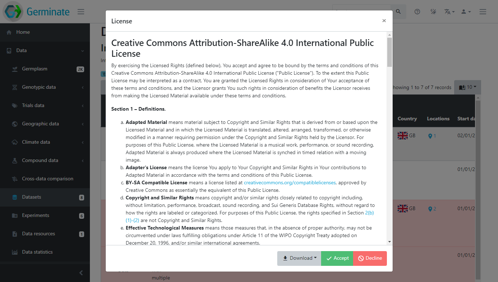

You will see that once you accept the licence all datasets that are assigned **the same** licence will now be accessible and the red colouring is removed indicating you can now freely access the data.

>If you are logged into Germinate the licences you have accepted are remembered between sessions.

> If you are not logged into Germinate you will need to accept any data licences next time you use the platform.

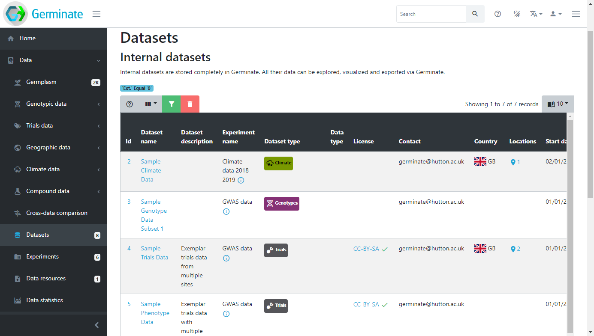

Datasets can have additional metadata associated with them. This ensures that any additional information that is relevant to a dataset can be associated with it. Germinate currently supports Dublin Core metadata for datsets. Information from collaborators to where the dataset is from can be stored when data is submitted to Germinate. We will talk more about data submission later in this training but for he time being we will concentrate on data that has already been submitted and available through the platform. The example below shows where a location for a dataset has been provided and visualised in a geographical context. These sorts of tools are really useful in making data exploration interactive and showing users where datasets have been collected.

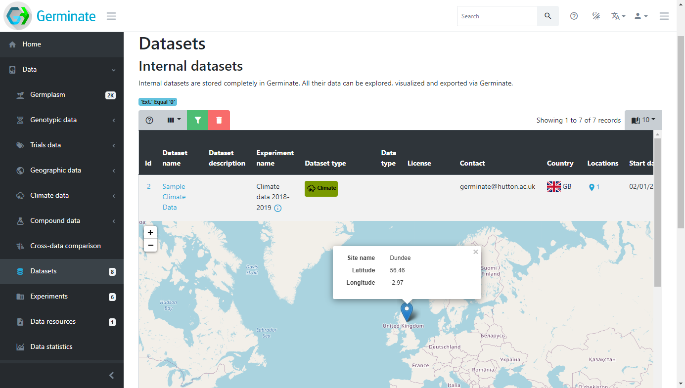

## Exporting data from datasets

Lets export some data and look at the options that are available in Germinate. Click on dataset 4 **Sample Trials Data** from the ***Datasets*** page in the Germinate Demo database. You should now see something like this:

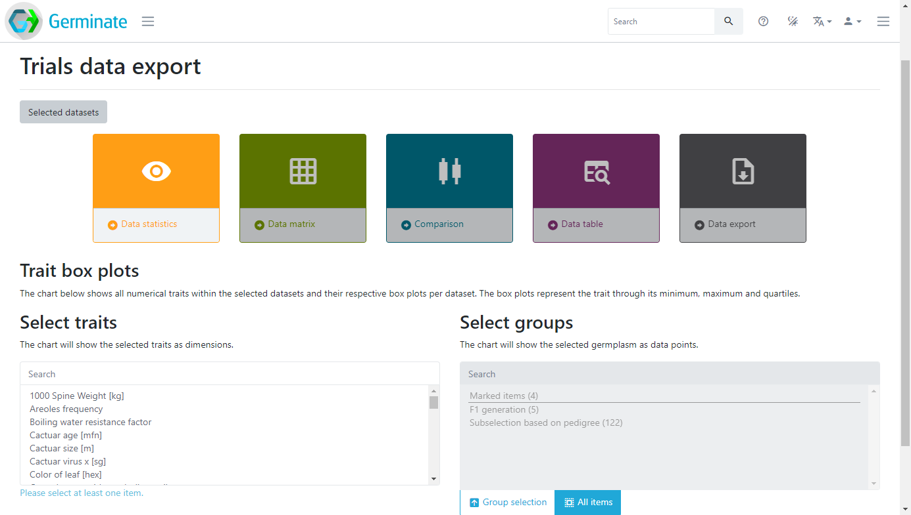

The coloured boxes show the different data visualization and data export options that are available for this dataset. There are also selection mechanisms to choose traits of interest and also to choose which groups you want to export data from. Groups will be covered later in this material but it is a way to allow subsets of large germplasm collections to be created and used to export data against. You only get data for germplasm entries that you are actually interested in. Here we are going to select only the traits highligted in grey, and we won't use a specific group in this case. We are also going to click the **Data statistics** option then finally click on **Plot**. Germinate will now go and perform some basic calculations to generate box plots for those traits across all germplasm entries within the selected dataset.

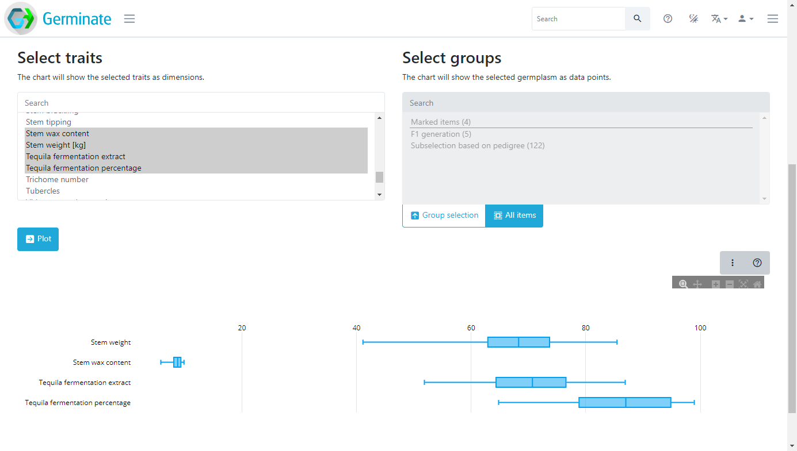
Now click on the **Data matrix** option and select the traits again then cilck on **Plot** which will generate a matrix of scatterplots as shown here. Try hovering your mouse pointer over points to see what additional information is displayed.

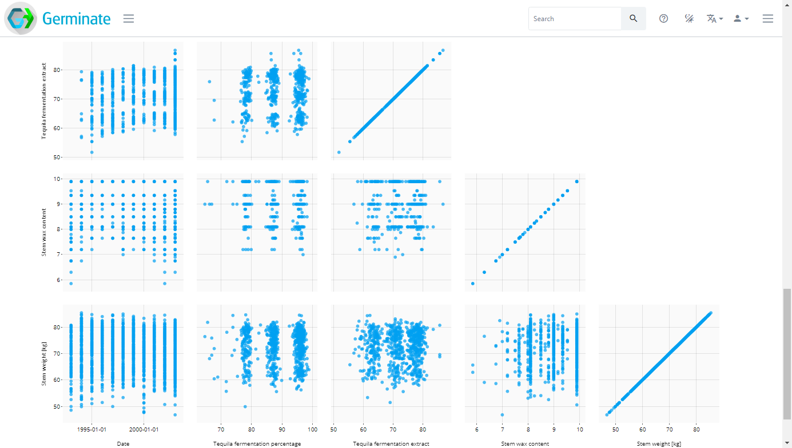

These charts are very informative but we can improve by introducing colour. In the **Colour by** section below where we selected our phenotypes click and select the **Trial Site** option in the drop down box.

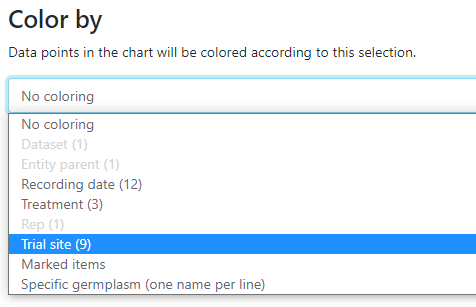

This will then colour the matrix by the trial sites which underly the data. Not all data will have trial sites but in this case we have a few sites from Scotland. Colouring allows you to visualize differences in the data easily.

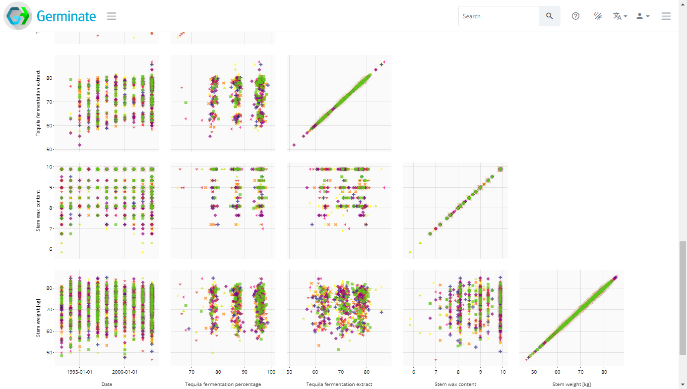

The final dataset visualization that we will show here is the **Comparison** tool which allows us to compare lines within a line group to be compared using boxplots. Boxplots allow us to visualize the spread of data. Single phenotypes can be selected then the charts redrawn. This tools is very effective in looking across germplasm within a group looking for lines with high or low values as well as identifying lines where data may be inaccurate or have unusual outliers (very high or very low values). Click the **Comparison** option then select traits as before, now choose a group (this is a new step required for the **Comparison** option) then click on **Compare** and a chart similar to this will be generated. 
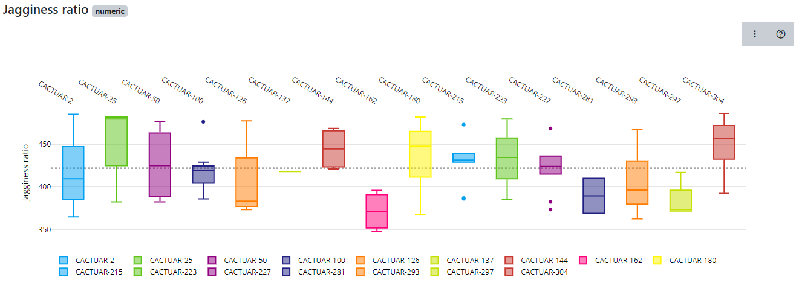

The charts are interactive so if you hover over a boxplot the charts will show the maximum value, median value and minimum value along with the first and third quartile values. Our boxplot visualization can also be exported into bitmap or vevctor based formats for use in presentations or publicataions as well as tools to allow colours to be changed and allowing users to download the underlying data used to generate the chart.

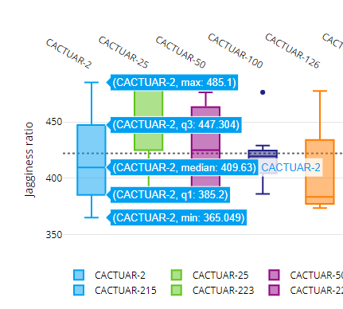

Additional information on how to interpret boxplots can be [found here](https://en.wikipedia.org/wiki/Box_plot). Have a play about with the boxplot feature and explore the options that it gives you in providing an overview of a trait held in the database.

Finally, all data from datasets can be exported in text format. We offer an interface that allows users to select data to be exported. To see how this works select the **Data export** option then select your traits of interest then click on **Export**. A plain text file containing the data will then be downloaded to your computer.

## Tasks:

1. 

How many datasets are available in Germinate?
Answer: There are 9 datasets available in the demo version of Germinate.

2. 

Of the datasets how many are genotypic datasets?
Answer: There are 2 genotypic datasets.

3. 

Select datasets with the ID of 5 and then select the 'Ear height' and 'Ear length' traits. Plot this data. What is the median 'Ear height' in this dataset?
Answer: 138.65

4. 

Using dataset ID 5 again plot the same data as in Q3 but this time use the 'Data matrix' option to determine the plant with the largest ear length and the plant with the largest ear height.
Answer: ear length = CACTUAR-1869, ear height = CACTUAR-1058. Also note that when plotting only 2 traits this representation shows a density estimate of the datapoints too.

Next Steps:  We have learned a bit about interacting with germplasm records in Germinate, now [lets have a look at working with Germinate groups in Session 5](session-5.html).

> ### About
> This training has been created under the [Templeton World Charity Foundation, Inc.](https://www.templetonworldcharity.org/) Grant ID TWCF0400 *'Safeguarding crop diversity for food security: Pre-breeding complemented with Innovative Finance'* which is managed by the [Crop Trust](https://www.croptrust.org/). This training is free to use and released under a non-restrictive open source licence.

  
  
  

