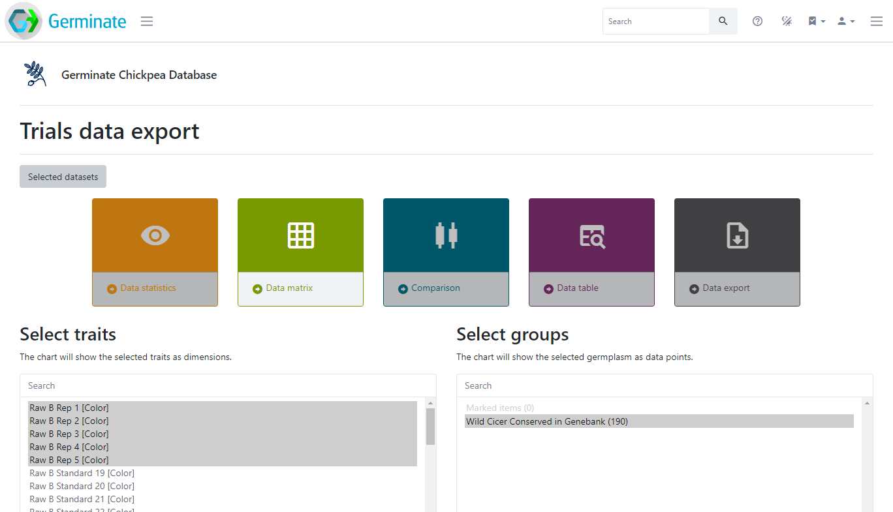
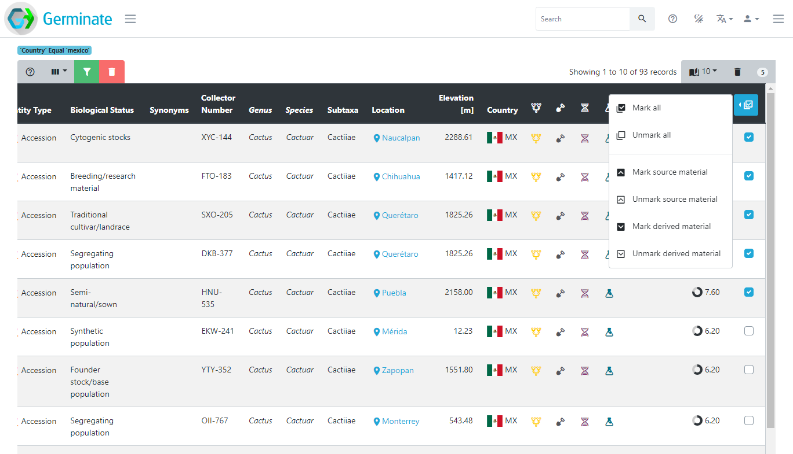
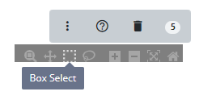
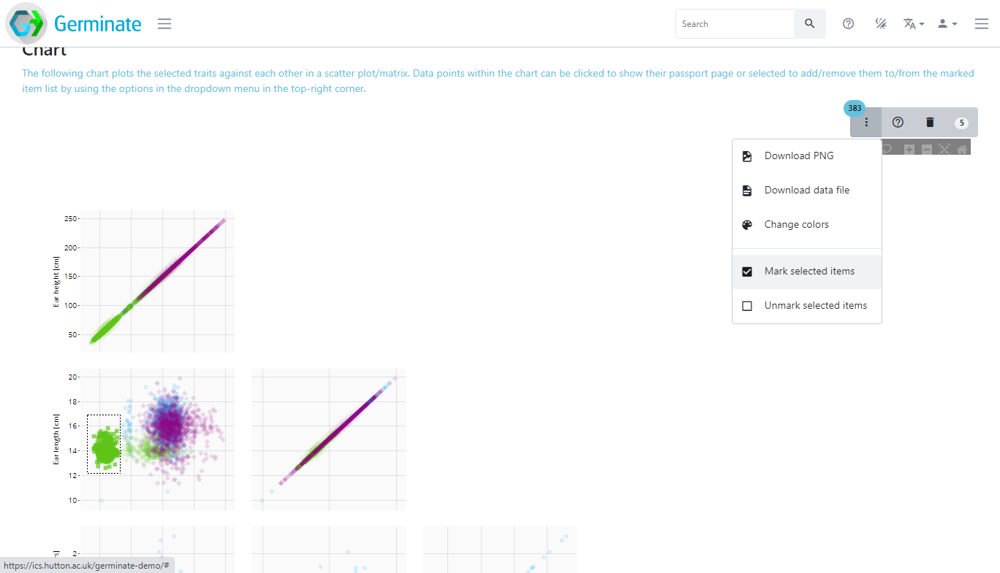
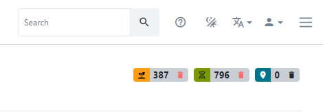
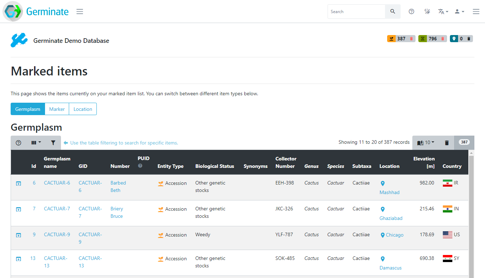

<!-- Use these horrible HTML tag attributes because Markdown only supports limited HTML/CSS -->

  

<table bgcolor="white" align="center">
  <tbody>
    <tr>
      <td align="center" valign="middle">
        
      </td>
      <td align="center" valign="middle">
        
      </td>
      <td align="center" valign="middle">
        
      </td>
    </tr>
  </tbody>
</table>

# Session 5: Working with Groups

So far we have been looking at data for the whole set of germplasm and all markers. In many cases, people do not want to download all available data, but only a specific subset of interest. To facilitate this, Germinate uses the mechanism of **groups** and **lists**. These groupings are used to define meaningful subsets of germplasm, markers and locations. **Groups** are persistantly stored subsets of data while **lists** are available just to yourself.

Groups and lists are particularly useful when exporting data. As an example from the **Crop Wild Relatives** project, all germplasm collected in the wild can be grouped together to simplify the export of phenotypic and genotypic data restricted to CWRs. The example below shows the Germinate Chickpea database with a pre-defined group called "**Wild Cicer Conserved in Genebank**". Using this group will only export data related to the germplasm in the group.

Anyone can create a list of germplasm by many means. One way is to use the table filtering mechanism. In the example below, we have filtered the germplasm table by `country` and searched for `mexico`. The resulting table shows 93 germplasm from Mexico. You can then add individual germplasm to your current list by ticking the checkboxes on the very right of the table (you may have to scroll across) or by using the dropdown menu in the last table header and selecting "**Mark all**". The number in the top right of the table (`5` in this case) shows how many germplasm are currently on your list.

Similarly, when exploring data visually using charts (as seen in Session 4), you can use the chart selection options found in the top right of any chart and select either **Box Select** or **Lasso Select** where available.

Then draw a shape around the data points you wish to select. In the example, we have drawn a rectangle around a large group of green data points. The number of selected germplasm in this area is highlighted in the blue ellipse (`383` germplasm) in the top right of the chart. To then add the selection to your current list, use the additional chart options represented by the dropdown menu with the three vertical dots and select "**Mark selected items**".

You can see the content of your list at any time by clicking on the respective marked item button in the top right corner of Germinate.

This will take you to a page showing all items currently on your list. You can switch between the **germplasm**, **marker** and **location** list above the table.

Let's see what this looks like in practice. In this example, we have X germplasm groups. [Explain the individual groups]. When selecting a phenotypic dataset, these groups can be selected on any visualization to only show data for these groups. On the download page, these groups are also available to restrict the download to germplasm from these groupings. 

 

Tasks: 

Navigate to the groups page. How many groups are there in total? 

How many of them are germplasm groups? 

Sort the germplasm groups by their size, how many germplasm are in the largest group? 
## Tasks:

1. 

Identify the maps page. How many maps are there?
Answer: X

> ### About
> This training has been created under the [Templeton World Charity Foundation, Inc.](https://www.templetonworldcharity.org/) Grant ID TWCF0400 *'Safeguarding crop diversity for food security: Pre-breeding complemented with Innovative Finance'* which is managed by the [Crop Trust](https://www.croptrust.org/). This training is free to use and released under a non-restrictive open source licence.