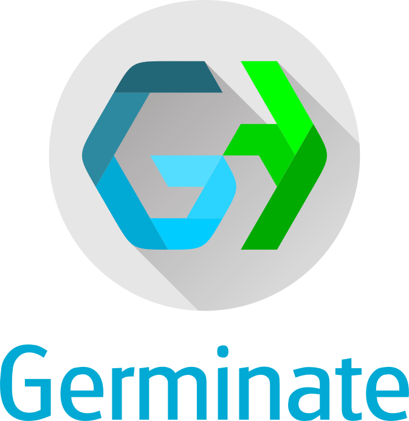

<!-- Use these horrible HTML tag attributes because Markdown only supports limited HTML/CSS -->

  

Contact us: [germinate@hutton.ac.uk](mailto:germinate@hutton.ac.uk) or [@germinatehub](https://www.twitter.com/germinatehub) on Twitter

# Session 5: Working with Groups

So far we have been looking at data for the whole set of germplasm and all markers. In many cases, people do not want to download **all** available data, but only a **specific subset** of interest. To facilitate this, Germinate uses the mechanism of **groups** and **lists**. These groupings are used to define meaningful subsets of germplasm, markers and locations. **Groups** are persistantly stored subsets of data while **lists** are available just to yourself.

Groups and lists are particularly useful when exporting data. As an example from the **Crop Wild Relatives** project, all germplasm collected in the wild can be grouped together to simplify the export of phenotypic and genotypic data restricted to CWRs. The example below shows the Germinate Chickpea database with a pre-defined group called "**Wild Cicer Conserved in Genebank**". Using this group will only export data related to the germplasm in the group. This is for chickpea but one of the benefits of Germinate is all databases look the same and have the same features. You can have a look yourself by going to the Germinate hompage then selecting chickpea form the databases or by following this link [https://ics.hutton.ac.uk/cwr/chickepea](https://ics.hutton.ac.uk/cwr/chickpea) - give it a go and have a look at one of our other Germinate databases!

Lets jump back to the [Germinate training database](https://ics.hutton.ac.uk/germinate-training) and continue looking at groups now.

Anyone can create a list of germplasm by many means. One way is to use the table filtering mechanism. In the example below, we have filtered the germplasm table by `country` and searched for `mexico`. The resulting table shows 93 germplasm from Mexico. You can then add individual germplasm to your current list by ticking the checkboxes on the very right of the table (you may have to scroll across) or by using the dropdown menu in the last table header and selecting "**Mark all**". The number in the top right of the table (`5` in this case) shows how many germplasm are currently on your list.

Similarly, when exploring data visually using charts (as seen in Session 4), you can use the chart selection options found in the top right of any chart and select either **Box Select** or **Lasso Select** where available.

Then draw a shape around the data points you wish to select. In the example, we have drawn a rectangle around a large group of green data points. The number of selected germplasm in this area is highlighted in the blue ellipse (`383` germplasm) in the top right of the chart. To then add the selection to your current list, use the additional chart options represented by the dropdown menu with the three vertical dots and select "**Mark selected items**".

You can see the content of your list at any time by clicking on the respective marked item button in the top right corner of Germinate. In this case you can see that we have **387** germplasm entries, **796** genetic markers and **0** locations in our group. 

If you click on one of the numbers it will take you to a page showing all items currently on your list. You can switch between the **germplasm**, **marker** and **location** list above the table. In this case clicking on a germplasm item will then take you to the relevant plant passport page for the germplasm item.

We will use groups in the next couple of tutorials where we will look at exporting genotypic and phenotypic data from Germinate.

Tasks: 

Navigate to the groups page. How many groups are there in total? 

How many of them are germplasm groups? 

Sort the germplasm groups by their size, how many germplasm are in the largest group? 
## Tasks:

1. 

Go to the groups page. How many maps groups are there?
Answer: 3

2. 

Select the germplasm groups then choose the one named 'F1 generation'. Explore the information that is available for one of the plants and explore.
You should be able to acess all the background data we have on each line on these pages. They contain a lot of information sometimes so explore and remember that data is always in the same order - in every Germinate database.

3. 

Go to dataset with the ID of 5. Now plot ear length against ear height using the data matrix option. Now limit this to just the 'Subselection based on pedigree' group. Colour based on 'treatment'. What is the plant line with the largest 'ear length' value?

Answer: CACTUAR-1930

4. 

Now using the chart from 3. create a group with all lines where 'ear height' is above 200. How many are there?
Answer: 6

These are simple examples but will give you an appreciation on how groups can be created. We also have other ways to create groups from germplasm tables which we will cover later. The best way to see how groups works is to experiment, create some and watch that group indicator increase or decrease as you add and remove plant lines.

Next Steps:  We have learned a bit about interacting with germplasm records in Germinate, now [lets have a look at working with genotypic data in Session 6](session-6.html).

> ### About
> This training has been created under the [Templeton World Charity Foundation, Inc.](https://www.templetonworldcharity.org/) Grant ID TWCF0400 *'Safeguarding crop diversity for food security: Pre-breeding complemented with Innovative Finance'* which is managed by the [Crop Trust](https://www.croptrust.org/). This training is free to use and released under a non-restrictive open source licence.

<table bgcolor="white" align="center">
  <tbody>
    <tr>
      <td align="center" valign="middle">
        
      </td>
      <td align="center" valign="middle">
        
      </td>
      <td align="center" valign="middle">
        
      </td>
    </tr>
  </tbody>
</table>