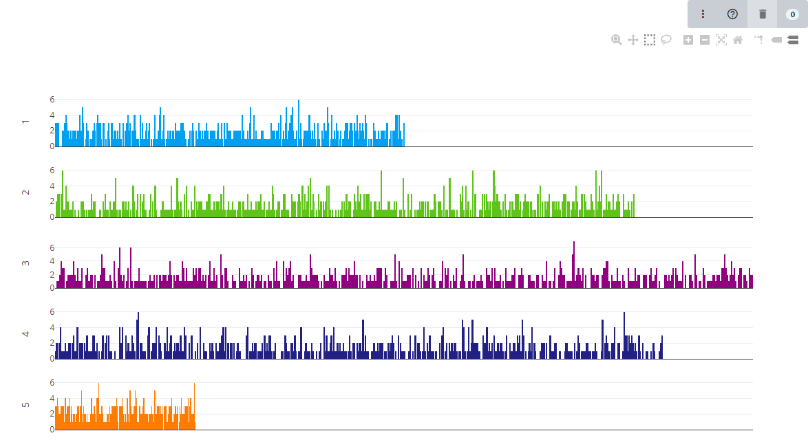
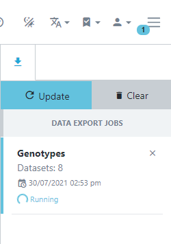

<!-- Use these horrible HTML tag attributes because Markdown only supports limited HTML/CSS -->

  

# Session 6: Genotypic data

Germinate stores genotypic data in the form of an allele call for a specific locus. Genetic and physical maps are stored alongside this data and can be explored independently by selecting the **maps** item in the main menu. Let's locate that and click on it to see what maps we have in the Germinate training database.

The table displayed shows all maps stored in Germinate along with the number of markers thathave positions on them. Germinate does not care if the maps are genetic or physical as long as the marker indexing system is consistent and makes sense across the entire map.

Click on the **All markers** map.

Upon selection, all markers and their positions are displayed both in tabular form as well as in a density histogram per chromosome or linkage group. If you want more information on a specific marker you can click on its name. You will then be able to see which other maps the marker is assigned to and all **genotypic datasets** that contain a marker with this name in Germinate.

The **density histogram** shows the distribution of markers across a chromosome. The height of the bar indicates the number of markers which are within that location. We use 500 bins across the chromsome.

> For markers with an unknown position we usually assign them to chromosome or linkage group 'U' which allows us to distinguish them easily in Germinate or when using graphical genotyping tools such as [Flapjack](https://ics.hutton.ac.uk/flapjack).

> Groupings of markers can be created by filtering the table or selection within the density chart. These are then available during the genotypic data export. For more on Germinate groups please review Session 5.

### Exporting data

Now we will work on exporting genotypic data from Germinate. To start go to the left hand menu then select the **Data**->**Genotypic Data**->**Genotypic export** option as shown below.

To export genotypic data, select a **single** or **multiple** dataset(s) from the table on the genotypic export page. Select datasets by clicking on the blue lefthand column and a tick will appear for datasets that will be used in the export process. While most exports of data will be from a single dataset there are occasions where data may be split across datasets and Germinate is able to merge genotypic data based on the marker names across datasets.

Select your datasets (in this case both of them) then click on **Next**.

On the next page, data can either be exported as a whole dataset or by sub-setting using groups or marked items covered in an earlier tutorial. Next, a map is chosen from the dropdown menu. Germinate supports multiple export formats for genotypic data. By default, the export will always include a flat tab-delimited file and optionally the same data in Flapjack or Hapmap format. 

You can easily switch between options by clicking the appropriate ones here. We would encourage you to have a play about with each of them to see the files that are returned. 

> Make sure the export to Flapjack option is selected for this tutorial.

Genotypic data is exported **asynchronously** meaning you can keep using Germinate while your requested data is exported. Germinate will let you know when your download is ready for download and you can continue to explore the genotypic data while the export is being processed by the Germinate server. You will see the download status by clicking the three line icon at the top right hand side of the Germinate interface beside the user options.

> The asynchonous downloads can be toggled by pressing the three lined icon to toggle.

The following images show you what this process will look like. Note how in the left hand image it shows the export job as **Running** and in the right it has completed and is offering **Download** options along with information on when the job was run and the resulting file size.

 

> If you don't have flapjack installed now is a good time to do that. You can get more information on installing Flapjack by looking at this [Flapjack training session](flapjack-2.html) we have developed.

In this case we exported Flapjack format files so click on **Download** then extract the resulting zipped folder on your computer and double click the Flapjack file to automatically load the data into Flapjack.

## Tasks:

1. 

Identify the maps page. How many maps are there?
To get to the maps page go to the left hand side Germinate menu then follow Data->Genotypic Data->Maps Answer: There is just one map defined in the Germinate training database.

2. 

How big is the largest map?
Answer: There are 5000 markers on the map.

3. 

What's the maximum position on chromosome 7?
Answer: 94,967

4. 

Go to the Genotypic data->Genotypic export page then select the dataset with ID3. Why do you think there are only 2,999 markers reported in the map selection box here while we saw that the map contains 5,000 markers in question 2 above?  
Answer: Germinate looks at the genotypic data and only exports data for markers that have data recorded against them. A map can contain markers that are not in a dataset.

5. 

Export data for one of the datasets then download the zip file and have a look at the 3 files that it contains.
Remember if you select to download in Flapjack and/or HapMap then additional files will be creted and included in your download.

6. 

Try loading your data into Flapjack by either importing raw data or by using the generate Flapjack option.
You will need to have Flapjack installed try <a href="flapjack-2.html">this tutorial</a> on installing Flapjack.

Next Steps:  We've learned a bit about genotypic data in Germinate, now [lets have a look at working with phenotypic data in Session 7](session-7.html).

> ## About
> This training has been created under the [Templeton World Charity Foundation, Inc.](https://www.templetonworldcharity.org/) Grant ID TWCF0400 *'Safeguarding crop diversity for food security: Pre-breeding complemented with Innovative Finance'* which is managed by the [Crop Trust](https://www.croptrust.org/). This training is free to use and released under a non-restrictive open source licence.

  
  
  

