<!-- Use these horrible HTML tag attributes because Markdown only supports limited HTML/CSS -->

  

# Session 7: Phenotypic data

This tutorial will show you how to explore, visualize and export phenotypic trials data.

## Traits

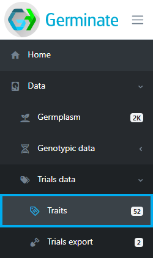

The traits page shows all traits that have been scored across all trials within Germinate, their data types, synonyms, units and how many individual data points have been recorded.

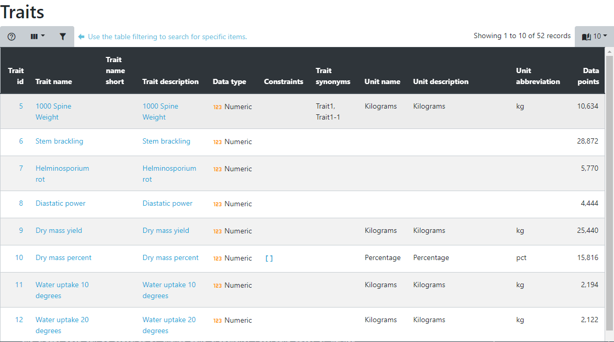

Selecting a trait opens the trait details page with all values for this trait in a table. As with all other tables, this one can be sorted and filtered, allowing you to search for things like which germplasm has the highest or lowest value or you can search for germplasm within specific ranges.

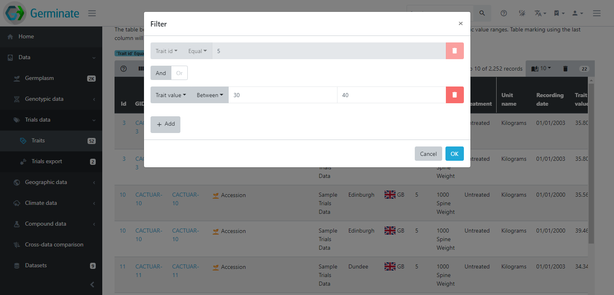

Below the table, a chart shows the distribution of values for this trait. In case of numeric traits, a boxplot will highlight the quartiles and for a categorical trait, a histogram is displayed.

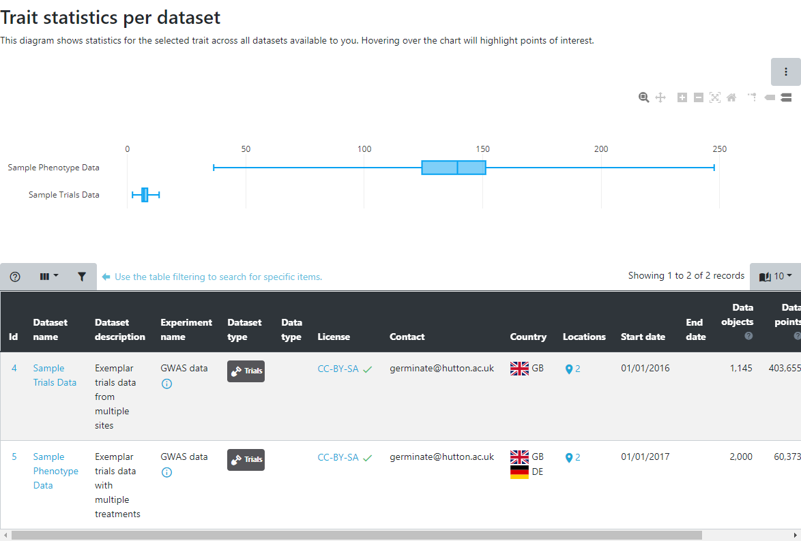

## Trial export

Comparing trials in different locations or across years as well as comparing traits to identify correlations and outliers can provide detailed insight into the data. The trials export page has a variety of visualization and query interfaces to explore trials data.

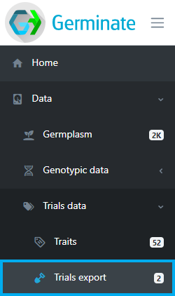

Select one or multiple trials from the datasets table to continue.

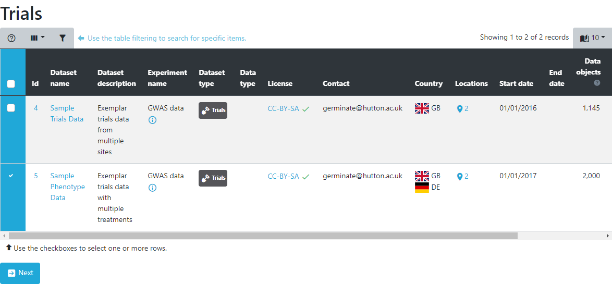

Trials information is broken down into sections. Each one offers a different perspective onto the data and various ways of sub-selecting germplasm and traits as well as different colouring options.

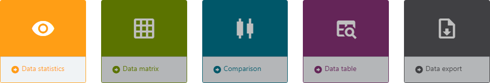

The overview statistics show overall characteristics of the data within the selected datasets. Select the traits you want to see and optionally some germplasm groups. The resulting chart shows a box plot per trait and dataset highlighting the spread within a trait as well as the differences between seleccted datasets. If the datasets are from different locations/sites or years, this chart is an ideal way to compare these scenarios.

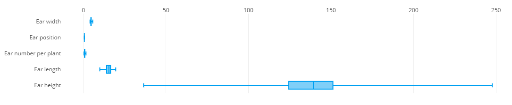

In the data matrix section, traits are plotted against each other to highlight patterns in the data like correlations and outliers. The traits that should be plotted are selected from the list. Optionally, a sub-selection of germplasm can be made to limit the visualization to only germplasm from these subsets. The resulting visualization is a matrix of scatter plots, each showing the combination of two traits. Each data point represents a germplasm scored for those two traits within the trial. Data can be coloured by things like treatment, recording date, or marked germplasm to further highlight the differences in the data.

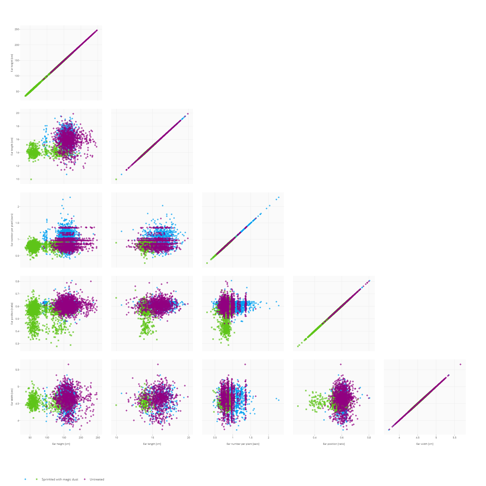

If only two traits are selected, a more detailed scatter plot is displayed showing 
data distributions along both axes.

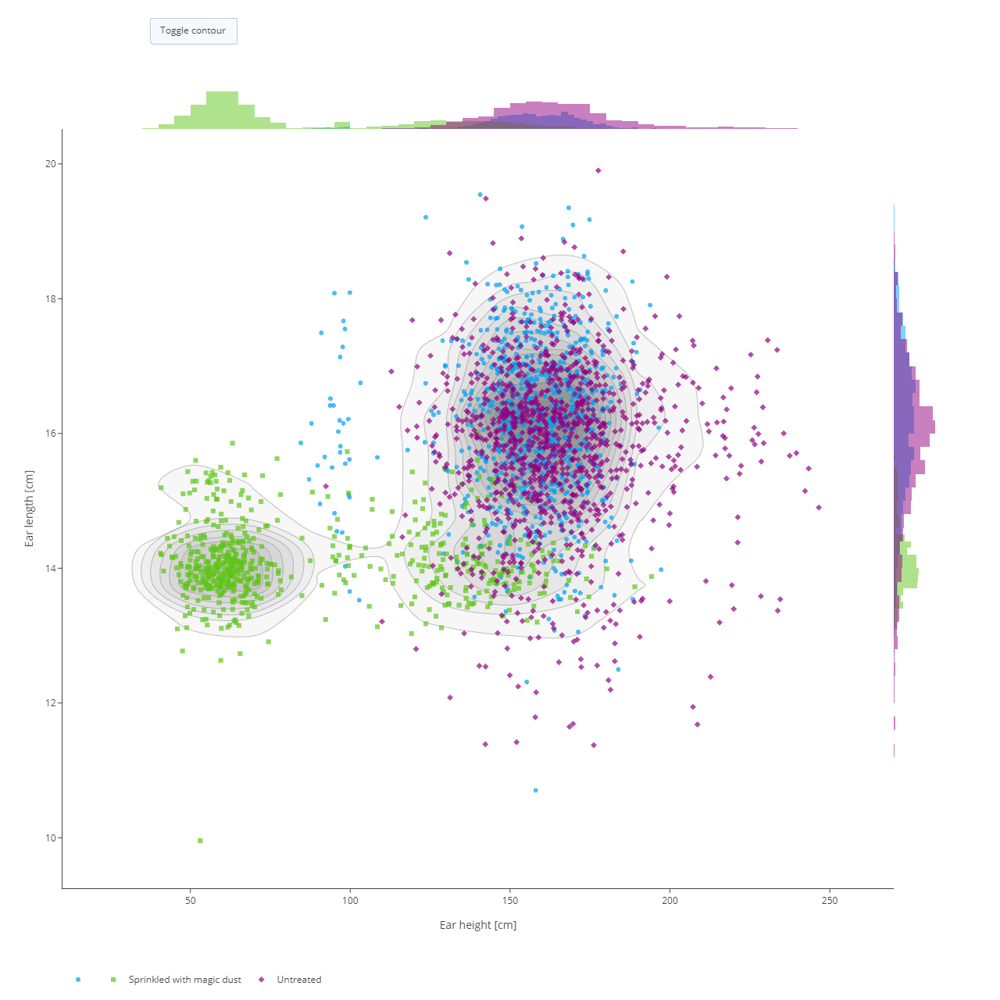

The comparison section will plot a small subset of germplasm side by side for a selection of traits to emphasize the germplasm performance compared to others. It will show a box plot of all values of a single germplasm compared to boxplots of the other germplasm.

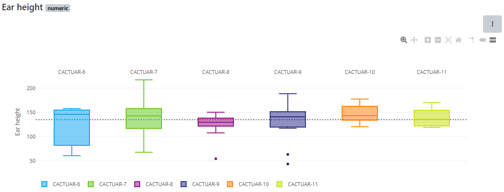

The data table presents a different perspective onto the data and offers all the table filtering and sorting functionalities already seen in previous tutorials. Searching for the data of a specific germplasm or finding germplasm within a yield range or above a certain height are easily achieved.

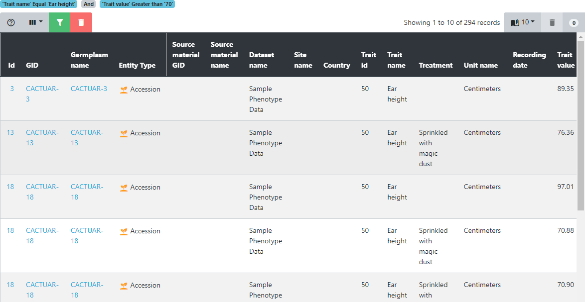

The final tab is where data can be downloaded in tab-delimited format. This format allows easy import into tools like Flapjack, Excel, and R. Combining this phenotypic data with the genotypic data in Flapjack.

## Tasks

1. 

Looking at the traits page, how many traits are in this Germinate database?
Answer: X

2. 

Sorting by the data points column, which trait has the most data points and how many?
Answer: X

3. 

Select trait X (categorical), which value appears most often?
Answer: X

4. 

Navigate to the trials export page and select the first two datasets. Using the overview statistics, which dataset has the higher average trait X?
Answer: X

5. 

Download the data using the last tab. Using Flapjack's data loading dialog, load the trait data into Flapjack along with the genotypic data from the previous tutorial.
Answer: X

> ## About
> This training has been created under the [Templeton World Charity Foundation, Inc.](https://www.templetonworldcharity.org/) Grant ID TWCF0400 *'Safeguarding crop diversity for food security: Pre-breeding complemented with Innovative Finance'* which is managed by the [Crop Trust](https://www.croptrust.org/). This training is free to use and released under a non-restrictive open source licence.

  
  
  

