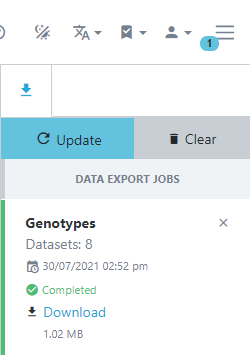

<!-- Use these horrible HTML tag attributes because Markdown only supports limited HTML/CSS -->

  

<table bgcolor="white">
  <tbody>
    <tr>
      <td align="center" valign="middle">
        
      </td>
      <td align="center" valign="middle">
        
      </td>
      <td align="center" valign="middle">
        
      </td>
    </tr>
  </tbody>
</table>

# Session 7: Genotypic data

Germinate stores genotypic data in the form of calls for a specific locus. Genetic and physical maps are stored alongside this data and can be explored independently by selecting the maps item in the main menu.

The table at the top shows all maps stored in Germinate along with the number of markers on them.

Upon selection, all markers and their positions are displayed both in tabular form as well as in a density histogram per chromosome or linkage group.

Groupings of markers can be created by filtering the table or selection within the density chart. These are then available during the genotypic data export.

To export genotypic data, select a single or multiple datasets from the table on the genotypic export page.

On the following page, data can either be exported as a whole dataset or by sub-setting using groups or marked items covered in an earlier tutorial. Next, a map is chosen from the dropdown menu. Germinate supports multiple export formats for genotypic data. By default, the export will always include a flat tab-delimited file and optionally the same data in Flapjack or Hapmap format.

Genotypic data is exported asynchronously meaning you can keep using Germinate while your requested data is exported. Germinate will let you know when your download is ready. Extract the resulting zipped folder and double click the Flapjack file to load the data into Flapjack.

 

## Tasks:

1. 

   
Identify the maps page. How many maps are there?

    ## Answer: X
   

2. 

   
How big is the largest map?

    ## Answer: X
   

3. 

   
What's the maximum position on chromosome X?

    ## Answer: X
   

4. 

   
Select the first genotypic dataset to export. How many germplasm groups are available?

    ## Answer: X
   

5. 

   
How many marker groups?

    ## Answer: X
   

6. 

   
Start the export process by selecting the "Flapjack" export format.

    ## Answer: X
   

