<!-- Use these horrible HTML tag attributes because Markdown only supports limited HTML/CSS -->

  

Contact us: [germinate@hutton.ac.uk](mailto:germinate@hutton.ac.uk) or [@germinatehub](https://www.twitter.com/germinatehub) on Twitter

# Session 8: Geographic Data

Germinate contains a few tools to work with geographic data. These can be found from the Germinate left hand side menu by selecting **Geographic data** The two options we have are to view **Locations** or do a **Geographic search**. To get started lets choose the **Locations** menu item and we can see the locations that we have stored in Germinate.

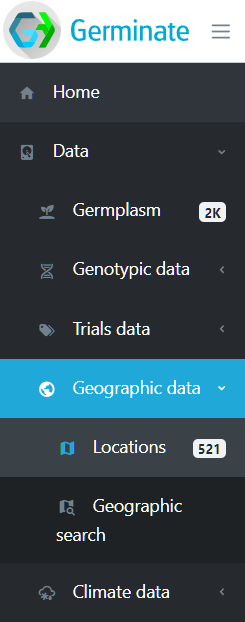

We can see from the menu that this version of Germinate contains 521 locations. Locations are either where a piece of germplasm has been collected or where a trial site is located. Click on **Locations** and we will look at them in greater detail. We can see below the information that is held in Germinate for locations. The **Type** column shows the type of location - in this case we only have collecting sites. Clicking on the location **Site name** will take you to a page with all germplasm assigned to that location. As with all Germinate tables clicking on table headers will toggle sort - then reverse sort. Filtering options are also available on the locations table.

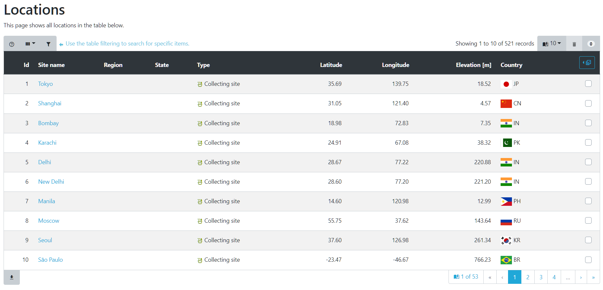 

In addition to lists of locations, Germinate also shows the position of locations on a map based visualization. Germinate provides two of these. The first (clustered) seen below shows numbers of germplasm within an area. As you zoom into the map the location numbers will change as you see finer scale detail. 

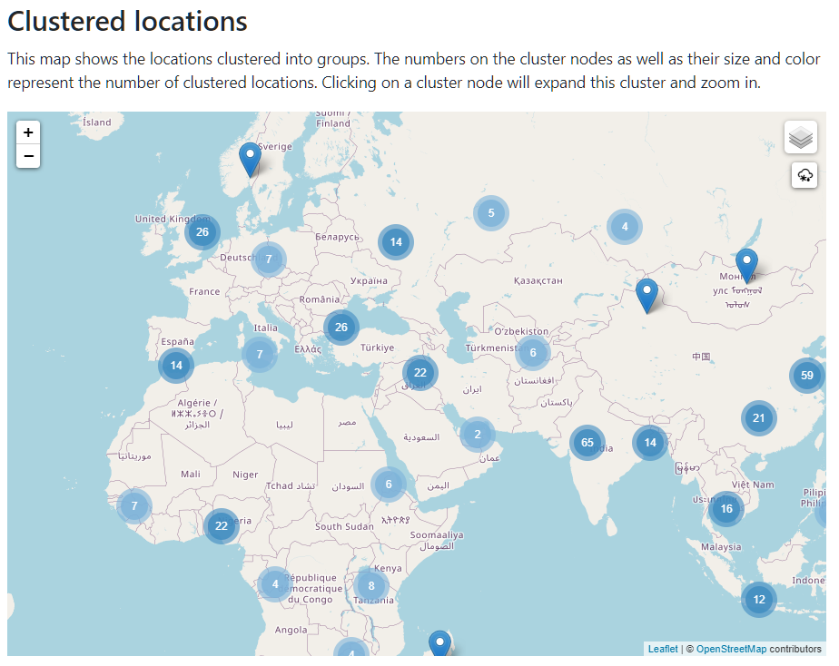 

The second representaion (heatmapped) shows a density map where the darker the colour the larger the number of locations that are within that area. Again you can zoom to see more detail within a region.

These sorts of representations give a good indicataion of the distribution of collection sites and trials held within Germinate.

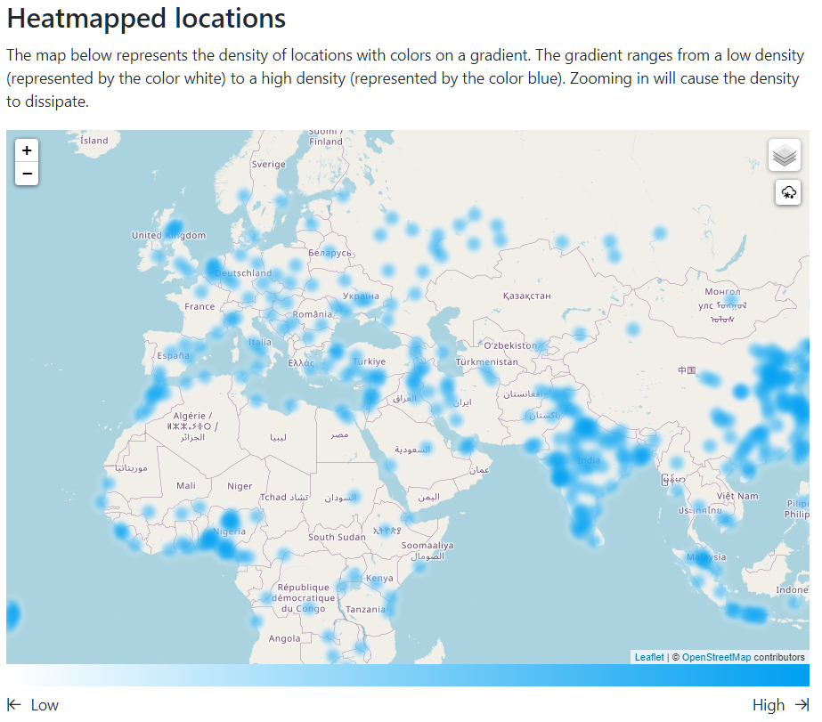 

So seeing where locations are is all well and good but what practical use do we have for these Germinate features? 

If we go back to our left hand Germinate menu then under **Data** -> **Geographic data** -> **Geographic Search** we will see the following interface. Make sure the **Point Search** option is selected at the top of the map. 

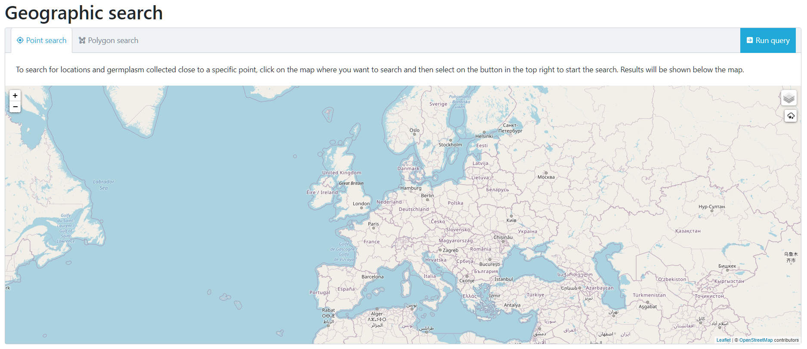

Now use your mouse to select a point on the map. In this case we have choosen somewhere near to us in Scotland. 

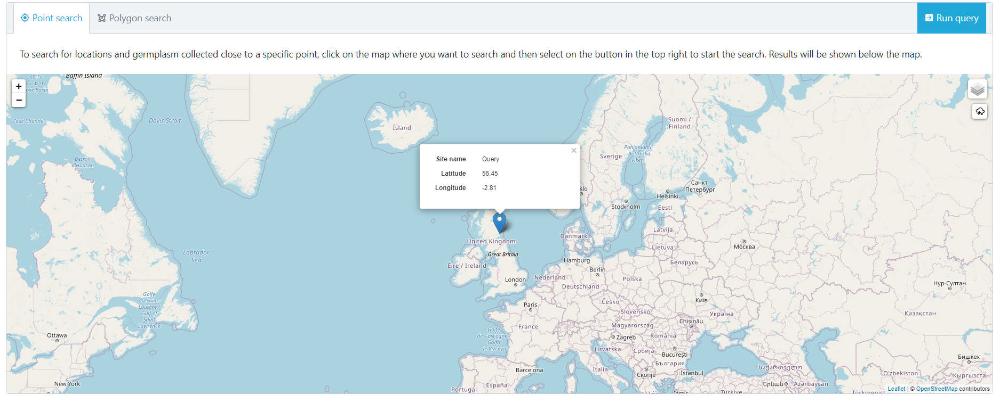 

Now click on the **Run query** button that is at the top right hand side of the map. This will go and look for locations which are close to our selected point.

You will see that after selecting **Run query** that we now have 2 data tabs which have appeared. **Locations ordered by distance** and **Germplasm ordered by distance**. These two tabs can be selected to reveal either a list of locations or germplasm ordered by the distance they are from the point we selected.

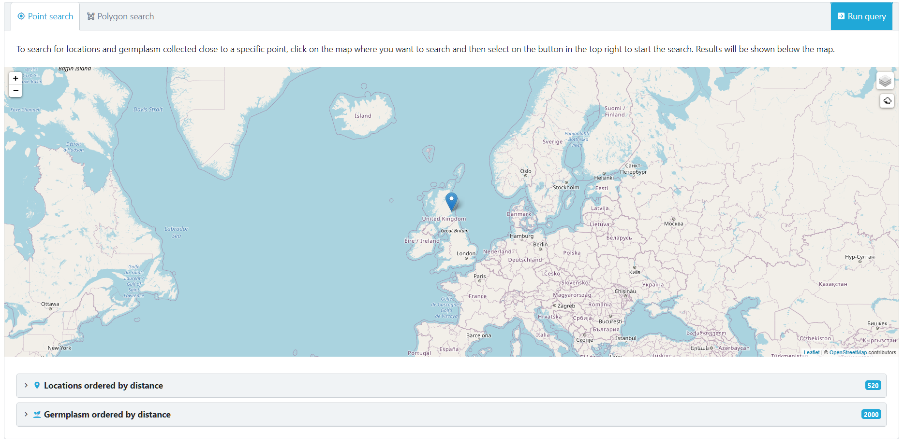 

 Click on the **Locations ordered by distance** tab.

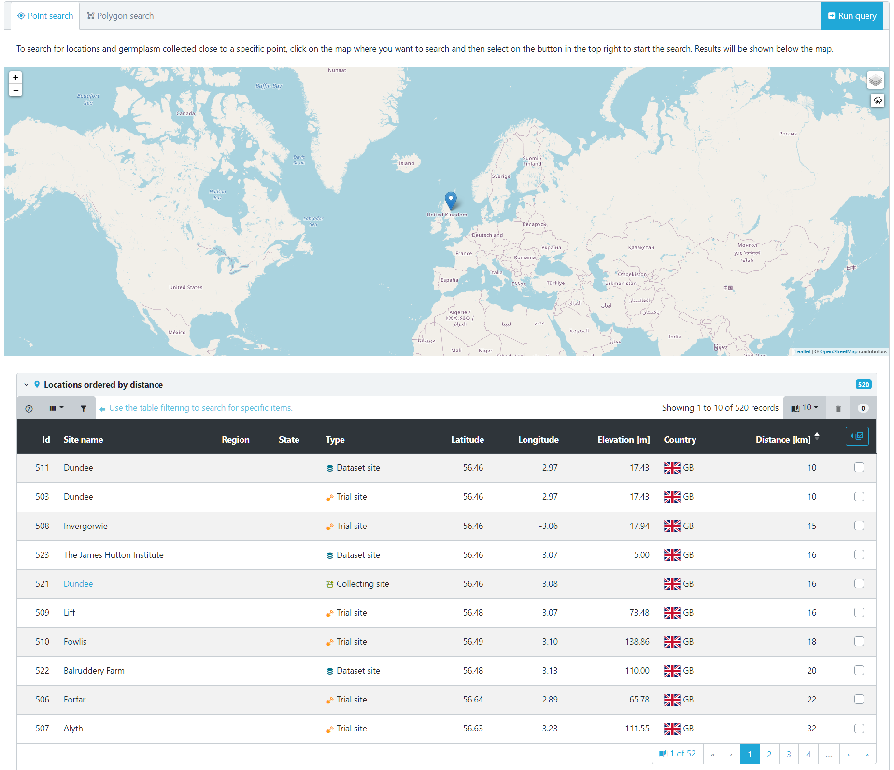 

This table then shows locations. You can see that we were pretty accurate with placing our tab and were only 16Km from the James Hutton Institute site in Scotland. Again this is a Germinate table so both sortable by clicking table headers of filterable by using table options. This table shows us that we have a number of different types of locations close to our pin - **Dataset site**, **Trial site** and **Collecting site** types. 

But what if we want to choose our own geographic region by drawing a bounding area? We can do that too. You need to select the **Polygon search** option from the top left of the map then use your mouse to select points on the map. Once you close an area by clicking on the first point a polygon will be defined.

Now cilck on **Run query** like before and Germinate will go and find all locations within the polygon that we defined.

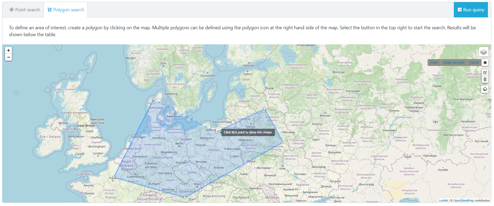 

Locations will be shown that are within the polygon that we just defined. 

Clicking on a **Site name** will take you to everything within that location.

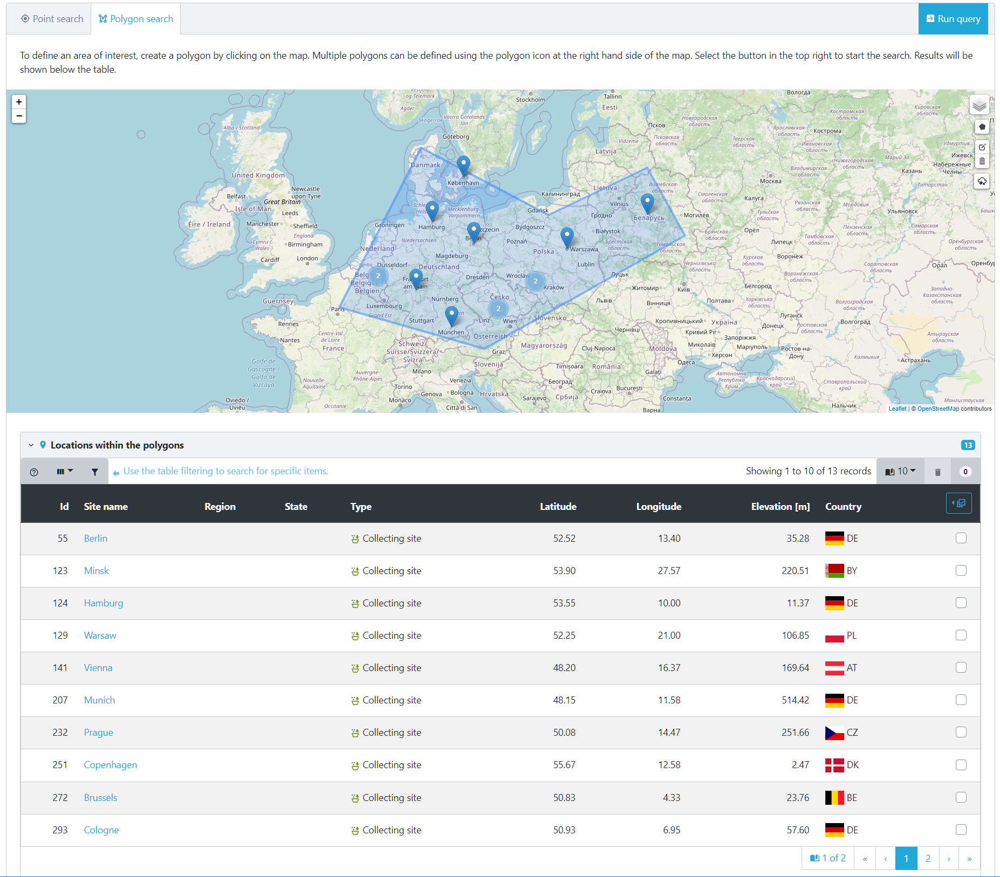 

Cilcking on a location will give you additional information about the location. In this case its a German location. 

> Remember you can zoom in an out of the map as well as pan it by clicking with your mouse.

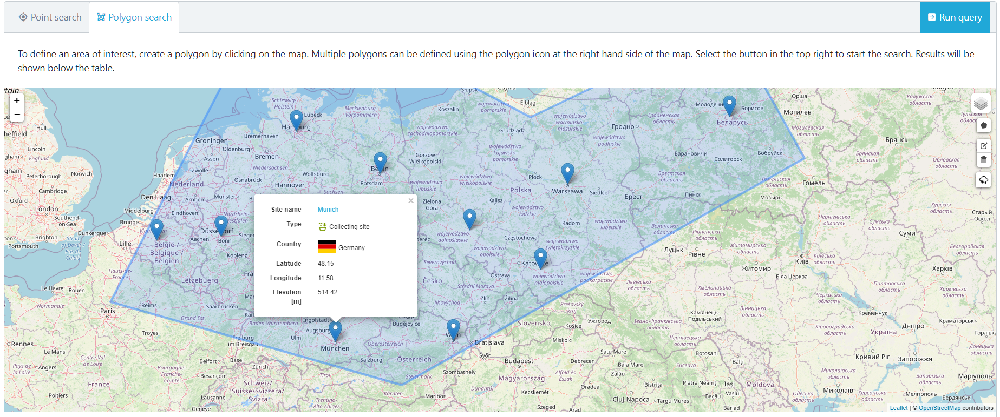 

But what can we do now we can accurately select locations within Germinate? Well one option would be to create a group of locations which can then be used to export data. To do that we can select the locations we are interested in from the table then select the table options which are highlighted here. Now choose **Create group**. We will cover creating and editing groups in another tutorial but it's worth remembering why we might want to use the geographic functions within Germinate.

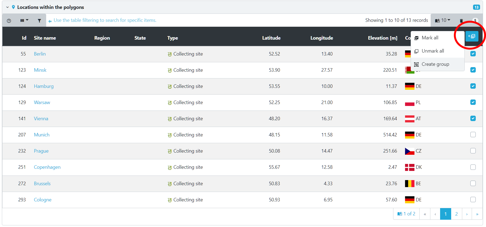 

## Tasks

1. 

Geography lesson - how many locations are in the United Kingdom?
Answer: There are 15 locations within the UK.

2. 

What is the closet location to Lisbon in Portugal? What is the furthest away plant line to Lisbon?
Answer: Sevilla in Spain (~314Km depending on where you dropped the pin) and there are a few plant lines that have locations in Sydney, Australia (around 18,000Km away). If you did not get this remember you need to cilck on the 'Distance [Km]' table column to sort (and maybe again to toggle).

Next Steps:  We've learned a bit about geographic data in Germinate, now [lets have a look at searching for and finding data in Session 9](session-9.html).

> ## About
> This training has been created under the [Templeton World Charity Foundation, Inc.](https://www.templetonworldcharity.org/) Grant ID TWCF0400 *'Safeguarding crop diversity for food security: Pre-breeding complemented with Innovative Finance'* which is managed by the [Crop Trust](https://www.croptrust.org/). This training is free to use and released under a non-restrictive open source licence.

  
  
  

