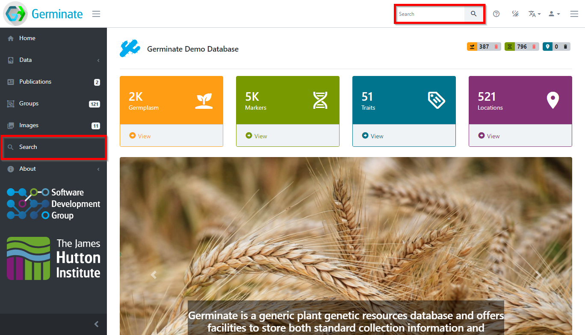
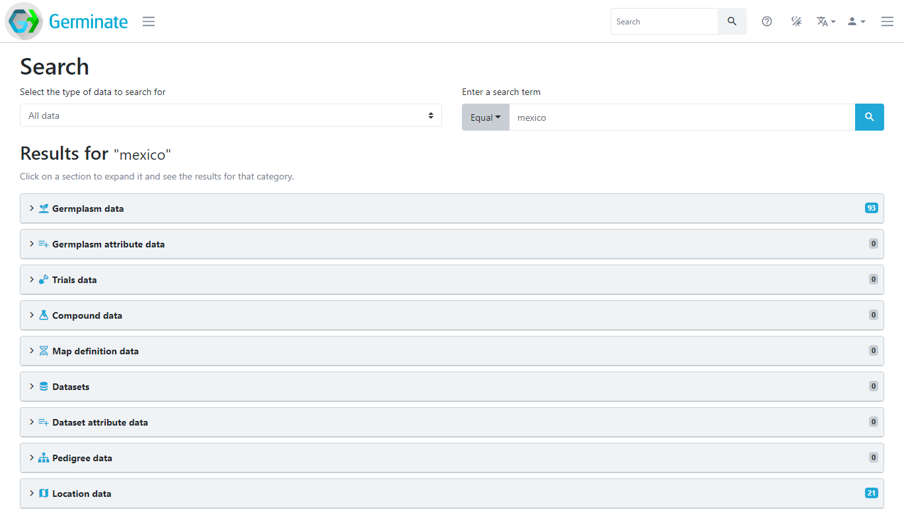
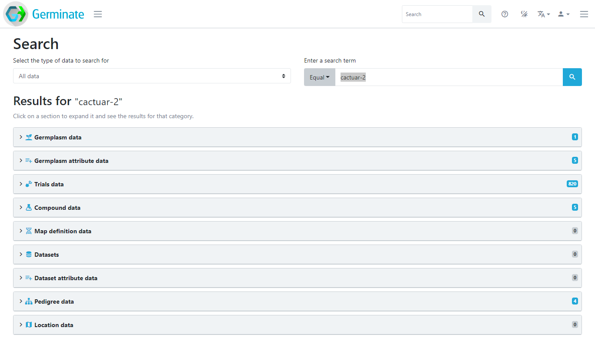
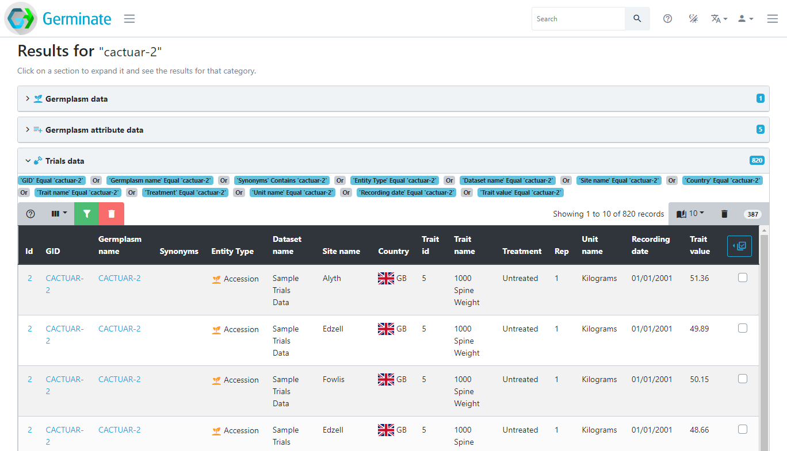
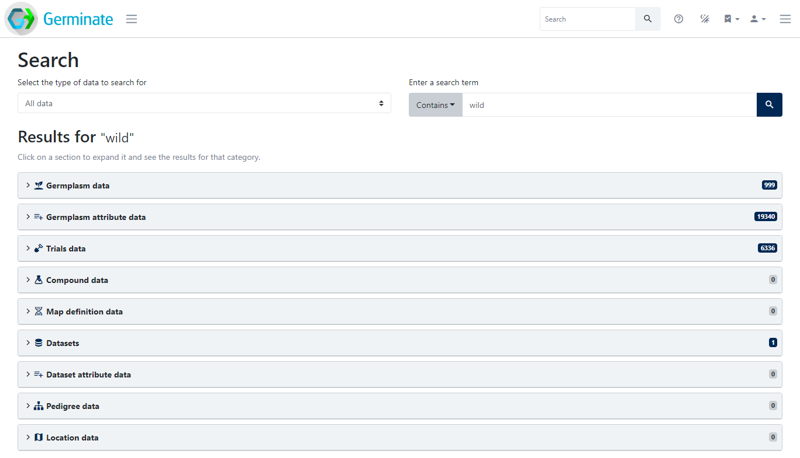

<!-- Use these horrible HTML tag attributes because Markdown only supports limited HTML/CSS -->

  

<table bgcolor="white" align="center">
  <tbody>
    <tr>
      <td align="center" valign="middle">
        
      </td>
      <td align="center" valign="middle">
        
      </td>
      <td align="center" valign="middle">
        
      </td>
    </tr>
  </tbody>
</table>

# Session 9: Searching for data

If you ever find yourself searching for a germplasm, a marker, a trait, or a location but you don't know the exact name, then the Germinate-wide search is where you'll find it. Simply type in a name-fragment into the search box at the top of the page and hit enter. Alternatively, first navigate to the search page using the main menu.

The search page will open and let you define what you're looking for. You can either search all data types or for any type individually. A click on the button starts the search and the results will be grouped into data type specific tables. So, if you're searching for a location name, you will see germplasm collected at this location as well as trials conducted at a location. Searching for a germplasm identifier will show the germplasm passport data as well as all trials and compound data recorded for this germplasm.

Let's look at some examples. Searching for `mexico` will return germplasm collected in Mexico as well as location information from Mexico.

 

Searching for a germplasm name returns all information related to this germplasm. In this case, there is passport data, trials data, compound data and pedigree data.

 

Clicking on any of the result sections will expand it and show all search results for the selected data type. If we click on the "**Trials data**" section, we can see all the trials data points relating to germplasm `CACTUAR-2`.

 

You don't have to search for the name of something, the search term can be anything. For example, searching for a specific treatment will return data points from trials with that treatment, searching for `wild` will return everything that contains the term `wild` as seen below.

 

Note that you may have to switch the comparison operator from `Equal` to `Contains` or even `Between` to fulfil your search needs.

> ### About
> This training has been created under the [Templeton World Charity Foundation, Inc.](https://www.templetonworldcharity.org/) Grant ID TWCF0400 *'Safeguarding crop diversity for food security: Pre-breeding complemented with Innovative Finance'* which is managed by the [Crop Trust](https://www.croptrust.org/). This training is free to use and released under a non-restrictive open source licence.